# Model Digger Project Knowledge Base

> Human and agent reference for product intent, architecture, code, validation, history, mistakes, current limits, and future direction.

| Field | Value |
| --- | --- |
| Product | Model Digger, formerly Open Model Advisor |
| Current product release | `v2.1.0` |
| Verified product commit | `7cb012a360fd94ac24c1f14addcb136d04e256f9` |
| Public repository | [tobyX-bot/open-model-advisor](https://github.com/tobyX-bot/open-model-advisor) |
| Public site | [tobyx-bot.github.io/open-model-advisor](https://tobyx-bot.github.io/open-model-advisor/) |
| Release architecture | Static HTML/CSS/JavaScript, native ES modules, static JSON catalog |
| Last knowledge verification | 2026-08-03 |
| Document status | Authoritative project consolidation; product-code baseline remains the `v2.1.0` tag |

## 1. Project Essence

Model Digger is a local-first open-model selection tool. It turns a user's actual computer configuration and intended AI workload into a short, explainable list of model routes that should be practical to try.

The user can paste a computer setup description or enter exact hardware manually. Model Digger extracts and reviews CPU, GPU, RAM, VRAM or unified memory, storage, operating system, and device type. After explicit user confirmation, it combines the hardware profile with task, task language, workload, deployment preference, and priorities. It then:

1. removes model routes that are incompatible or insufficiently supported;
2. scores only the remaining viable local routes;
3. deduplicates equivalent model families;
4. returns zero to three ranked starter recommendations;
5. explains fit, limitations, runtime, quantization or size target, licensing caution, and source provenance; and
6. shows hosted fallback separately when the user permits it and local execution is not the right path.

The core question is:

> Given this machine and this job, which open model route should I try first, and why?

Model Digger is not a leaderboard, benchmark authority, installer, legal adviser, or infrastructure sizing tool. Its score is a transparent practical-fit heuristic owned by this project. Official sources support factual model and runtime claims; they do not validate Model Digger's score.

### One-paragraph product definition

Model Digger is a local-first open AI model selection system that can accept pasted hardware descriptions today and may later use a local CLI or native helper to detect CPU, GPU, RAM, VRAM, storage, and operating system automatically. It combines those facts with task type, usage intensity, quality, speed, cost, deployment, language, and privacy requirements, then applies an explainable quantitative standard to return up to three viable model routes with model family, parameter or quantization target, runtime, expected fit, bottlenecks, and official entry points. The standard may learn from Hugging Face, llama.cpp, Ollama, LocalAI, model creators, runtime maintainers, and other open communities, but community claims must be normalized, source-graded, tested, calibrated, versioned, and never copied as unquestioned truth.

## 2. Why This Product Matters

Model discovery sites usually answer questions such as popularity, benchmark position, parameter count, or task category. They do not reliably answer whether a particular route is usable on a particular computer.

That gap matters because model choice is constrained by several interacting facts:

- a model family may support the task but not the user's language;
- weights may fit in storage but not in RAM or VRAM;
- a runtime may support CPU fallback while another route requires a dedicated GPU;
- a model may be technically runnable but too slow or operationally difficult for the workload;
- a model card may be official while a convenient quantization is community-maintained;
- license and hosted-provider terms can differ from the underlying model license; and
- a high benchmark score does not make a model the best operational starting point.

Model Digger reduces these decisions to an auditable sequence: identify the machine, expose uncertainty, establish hard feasibility, rank the viable set, and link the user to trusted next steps. The value is not merely recommending a name. It is preventing false confidence, impossible downloads, wasted setup time, and inappropriate cloud or license assumptions.

## 3. Current Product Scope

### Supported task categories

V2.1 supports exactly five categories:

1. General chat and writing LLMs
2. Coding LLMs
3. Image generation models
4. Speech-to-text models
5. Embeddings and semantic search models

The catalog currently contains 15 records: three per category.

### Supported interaction languages

- English interface and setup-text recognition
- Mainland Mandarin Chinese interface and setup-text recognition
- Relevant Simplified Chinese, Traditional Chinese, and mixed-language scanner forms in the frozen validation corpus
- Explicit task-language selection for English or Mandarin where model-route compatibility depends on language

The interface language and requested task language are separate. Switching the interface to Chinese does not silently change the requested model language.

### Current inputs

- Pasted computer setup text, capped at 20,000 UTF-16 code units after normalization
- Editable hardware examples and presets
- Exact CPU model text
- Exact GPU vendor and model text
- RAM, VRAM or usable unified memory, and free storage in GB
- Operating system and device type
- Internet availability
- Task and task language
- Workload: casual, daily, batch, production/team, latency-sensitive, or quality-sensitive
- Deployment: local only, local first, or cloud acceptable
- Priorities: privacy, quality, speed, setup ease, and commercial-use orientation

### Current outputs

- Up to three viable local model families, never padded with unsuitable candidates
- A prominent `Try first` recommendation and compact alternatives
- Size or quantization target
- Preferred runtime
- Practical-fit score and explanation breakdown
- Fit and performance labels
- Hardware-fit and avoid guidance
- Official model page and official runtime/setup guide
- Source publisher, source type, and verification date
- License caution and commercial-use status
- Catalog review date and stale-data behavior
- Separate hosted fallback, only when policy allows it
- Separate excluded or avoid guidance rather than presenting an unsuitable route as a recommendation

## 4. Explicit Non-goals And Boundaries

The current release intentionally does not provide:

- a backend, account system, server profile storage, telemetry, or analytics;
- a runtime Hugging Face, OpenAI, or other model API call;
- an API-key field;
- model download, installation, execution, or automatic configuration;
- silent hardware detection;
- a claim of universal free-form parsing accuracy;
- a claim of objective model quality or `best model overall`;
- live benchmarks or an exhaustive leaderboard;
- production throughput, concurrency, cluster, or infrastructure sizing;
- definitive legal or commercial-use advice; or
- TTS, vision-language, video, document-agent, or multi-agent workflow recommendations.

These are release boundaries, not permanent platform constraints. Model Digger may later become a native application or gain a local helper, cloud service, or richer category coverage. Such changes must preserve the trust model unless explicitly redesigned.

## 5. Product Evolution And Major Decisions

### Stage 1: Open Model Advisor V1

The original concept was a two-file static tool: `index.html` plus `models.json`. It used broad hardware tiers, category-first recommendations, local-first behavior, and static curation. This established the core product philosophy but generalized the hardware too aggressively.

### Stage 2: Exact hardware and local scanner

The V2 upgrade replaced CPU tiers such as low, medium, and top with exact CPU and GPU fields plus numeric capacity values. It added deterministic local parsing of pasted setup text, English/Mandarin switching, concrete starter models, runtimes, and quantization guidance.

### Stage 3: Reliability rebuild

A 200-user five-fold validation exposed that the first scanner was not reliable enough. Instead of continuing to patch one broad parser, the scanner was rebuilt as a normalization, candidate extraction, and resolution pipeline with evidence spans, explicit conflicts, and confirmation revisions.

### Stage 4: Recommendation correctness

The recommendation audit found that infeasible models could still appear because low scores and caps were being used where hard exclusion was required. The engine was changed to establish eligibility before scoring, deduplicate families, and return at most three viable routes.

### Stage 5: Product and visual integration

The name became **Model Digger**, with a shovel as the interaction and brand symbol. The approved **Porcelain Suspension** direction introduced layered warm-white frosted surfaces, graphite controls, restrained copper/tangerine status color, and a three-plane Input -> Review -> Recommendation workflow. Mock parsing and scores remained illustrative and were not copied into production.

### Stage 6: V2.1 public release

The verified scanner, confirmation state, exact hardware classification, source-backed ranking, bilingual UI, and Porcelain workflow were integrated and published as `v2.1.0` at commit `7cb012a`.

## 6. Current User Journey And State Machine

The release deliberately requires review. Scanning is not confirmation.

```mermaid
flowchart LR
    A["Raw setup text or editable example"] --> B["Normalize and segment"]
    B --> C["Extract typed candidates with evidence"]
    C --> D["Resolve exact, inferred, missing, unknown, or conflict states"]
    D --> E{"Blocking issue?"}
    E -- Yes --> F["Manual correction required"]
    F --> G["Apply profile operations"]
    E -- No --> G
    G --> H["Confirm current hardware revision"]
    H --> I["Choose task, language, workload, deployment, priorities"]
    I --> J["Hard compatibility filters"]
    J --> K["Score and rank viable families"]
    K --> L["0-3 local routes plus separate hosted fallback"]
```



### Required interaction rules

- `Scan` creates a pending result; it never silently changes the active profile.
- `Apply recognized setup` creates an atomic batch of profile operations.
- Applying a partial scan clears unresolved inherited hardware rather than leaving trusted-looking preset values.
- Unknown, invalid, conflicting, or required missing fields remain visible and block confirmation.
- A newly started scan invalidates the authority of an older pending scan session.
- Manual hardware edits increment the hardware revision and invalidate prior confirmation.
- Task, task language, workload, deployment, priority, and internet changes do not pretend to change hardware identity.
- A task detected from pasted text fills the task only when the user has not already chosen one.
- Recommendations unlock only for the currently confirmed hardware revision.

This state model prevents recommendations from remaining active after a material hardware edit, one of the risks identified during the rebuild.

## 7. Architecture

There is no build step and no backend. The production page uses native browser ES modules and loads a static catalog.

```text
index.html
styles.css
assets/shovel.svg
models.json
src/
  app.js
  catalog.js
  config.js
  hardware.js
  i18n.js
  model-copy.js
  profile-state.js
  render.js
  scanner.js
  scoring.js
  scanner/
    normalize.js
    patterns.js
    extractors.js
    resolve.js
validation/
  TEST_STANDARD.md
  TEST_STANDARD_V1_1.md
  VALIDATION_REPORT.md
  fixtures/
  *.test.mjs
  run-validation.mjs
  run-browser-validation.mjs
```

### Module ownership

| File | Responsibility | Important invariant |
| --- | --- | --- |
| [`index.html`](index.html) | Semantic shell, labels, controls, regions | The first screen is the working tool, not a landing page |
| [`styles.css`](styles.css) | Responsive Porcelain/Liquid Excavation visual system | No content-covering overlap; visible focus; reduced-motion support |
| [`src/app.js`](src/app.js) | Boot, event wiring, UI orchestration, derived workflow stage | Never rank an unconfirmed hardware revision |
| [`src/scanner.js`](src/scanner.js) | Public scanner facade | Normalize -> extract -> resolve; append truncation issue |
| [`src/scanner/normalize.js`](src/scanner/normalize.js) | Unicode normalization, caps, segmentation, evidence offsets | Evidence offsets come from normalized text, not lowercase indexes |
| [`src/scanner/patterns.js`](src/scanner/patterns.js) | Deep-frozen declarative pattern data | Patterns are ordered, immutable, and non-stateful |
| [`src/scanner/extractors.js`](src/scanner/extractors.js) | Pure typed candidate extraction and field ownership | Do not resolve conflicts or write final profile facts |
| [`src/scanner/resolve.js`](src/scanner/resolve.js) | Field-specific resolution and cross-field invariants | Conflicts abstain; no-GPU is atomic; evidence is retained |
| [`src/profile-state.js`](src/profile-state.js) | Atomic scan operations, revisions, provenance, confirmation | Stale sessions and partial mutation are rejected |
| [`src/hardware.js`](src/hardware.js) | CPU/GPU capability classification | Report vendor mismatch; never rewrite selected vendor silently |
| [`src/catalog.js`](src/catalog.js) | Fetch and validate static catalog | Reject incomplete, unsafe, or unstructured source records |
| [`src/scoring.js`](src/scoring.js) | Compatibility, scoring, ranking, fallback, labels | Hard eligibility precedes score and rank |
| [`src/model-copy.js`](src/model-copy.js) | Human-readable model and license guidance | Preserve caution and avoid benchmark claims |
| [`src/render.js`](src/render.js) | Escaped HTML output for scan and result states | User/catalog strings are escaped; external links are safe |
| [`src/i18n.js`](src/i18n.js) | English and native Mandarin product copy | Do not mechanically translate technical concepts |
| [`src/config.js`](src/config.js) | Weights, examples, presets, workflow stages | Presets are editable examples, not detected facts |
| [`models.json`](models.json) | Curated model and source catalog | Static, auditable, version-controlled data |

## 8. Scanner Design

### Public facade

The facade is intentionally small:

```js
export function scanSetupText(text) {
  const document = normalizeSetupText(String(text || ""));
  const result = resolveCandidates(document, extractCandidates(document));
  // A truncated input remains reviewable but is never silently accepted.
  return document.truncated ? withTruncationIssue(result) : result;
}
```

The exact implementation is in [`src/scanner.js`](src/scanner.js). The safety comes from the contracts below, not from the facade itself.

### 8.1 Normalization contract

- Coerce input deterministically.
- Apply a 100,000-code-unit pre-normalization safety ceiling.
- Create detached bounded storage so a small returned slice does not retain an arbitrarily large caller string.
- Apply Unicode NFKC normalization.
- Cap raw and normalized snapshots at 20,000 UTF-16 code units without splitting surrogate pairs.
- Preserve line and structural boundaries rather than globally compacting whitespace.
- Segment on line endings, semicolons, full-width semicolons, pipes, arrows, and space-delimited slash boundaries.
- Keep commas inside segments because they can be part of inventory text or numeric syntax.
- Store lowercase strings for comparison only. Unicode lowercase can change string length, so evidence offsets must come from normalized/original segment text.

### 8.2 Candidate extraction contract

Extractors emit candidates, not final values. A candidate includes at least:

```js
{
  field: "ram",
  value: 32,
  raw: "32GB RAM",
  start: 42,
  end: 50,
  segmentIndex: 2,
  confidence: "high",
  specificity: 90,
  source: "capacity.ram.explicit",
  inferred: false
}
```

The candidate layer recognizes:

- OS and device evidence;
- supported CPU and GPU families;
- constrained labeled unknown CPU/GPU models;
- no-dedicated-GPU statements;
- all five tasks in English and Chinese;
- RAM, VRAM, unified memory, and storage in label-before and amount-before forms;
- GB/GiB/TB/TiB normalization;
- natural memory forms explicitly supported by the frozen corpus;
- free/remaining storage semantics; and
- carefully bounded Apple unified-memory inference.

It abstains from:

- capacity ranges or lower/upper bounds that look like exact values;
- transfer rates such as GB/minute or GB/hour;
- used/occupied storage presented as available storage;
- incomplete compact lists whose values cannot be owned safely;
- numeric suffix matches inside malformed numbers;
- a nearby storage number being treated as VRAM;
- integrated GPU proximity being treated as dedicated VRAM;
- generic unknown models contaminated by capacity or task text; and
- field ownership that crosses structural or bilingual clause boundaries.

### 8.3 Resolution contract

The resolver produces one status per field:

- `resolved`
- `missing`
- `unknown`
- `conflict`
- `invalid`
- `not-applicable`

It preserves candidates and evidence in every field state. It does not choose an arbitrary winner when two distinct explicit facts conflict.

Numeric ranges are currently:

| Field | Minimum | Maximum |
| --- | ---: | ---: |
| RAM | 2 GB | 512 GB |
| VRAM / usable unified memory | 0 GB | 128 GB |
| Free storage | 1 GB | 4096 GB |

Key resolution rules:

- repeated equivalent values deduplicate;
- distinct explicit values conflict;
- explicit values outrank inferred values;
- free storage outranks total storage for recommendation capacity;
- no dedicated GPU resolves vendor, model, and VRAM atomically;
- explicit positive VRAM conflicts with a no-GPU statement;
- GPU vendor/model mismatch blocks the GPU group;
- Apple usable-memory VRAM remains marked inferred, never exact dedicated VRAM;
- labeled unknown models remain review evidence rather than entering scoring as exact identities; and
- required missing/unknown/conflicting hardware blocks confirmation.

### 8.4 Output shape

```js
{
  fields: { /* resolved values with confidence, reason, evidence */ },
  fieldStates: { /* status, candidates, resolved value for every field */ },
  issues: [ /* deterministic structured issues */ ],
  warnings: [ /* deduplicated message keys */ ],
  unresolvedFields: [ /* unresolved non-task fields */ ],
  blockedFields: [ /* fields that prevent confirmation */ ]
}
```

## 9. Hardware Classification

Parsing and capability classification are separate. The parser answers `what text evidence exists`; the classifier answers `how this exact model should influence practical fit`.

### CPU families

The classifier recognizes and tiers:

- Apple M1-M4, including Pro, Max, and Ultra distinctions;
- Intel Core i3/i5/i7/i9;
- Intel Core Ultra 5/7/9;
- AMD Ryzen 3/5/7/9;
- Xeon, Threadripper, and EPYC workstation/server families; and
- Celeron/Pentium low-tier families.

Unknown CPUs remain low-confidence and rely more heavily on explicit capacity facts. They do not crash the recommendation engine.

### GPU families

The classifier handles:

- NVIDIA RTX, GTX, Quadro/Tesla, and constrained professional A-series cases;
- AMD Radeon/RX and dedicated/integrated Vega distinctions;
- Intel Arc A/B, Iris Xe, and UHD classes;
- Apple unified GPUs; and
- explicit no-GPU/CPU-only systems.

Current families include RTX 50-series, Radeon 9000-series, and Arc B-series coverage added during hardening. Explicit selected-vendor/model disagreement is returned as a conflict instead of silently rewriting user input.

## 10. Catalog Contract

The catalog root contains metadata plus a `models` array. There are 15 current entries:

| Category | Current families |
| --- | --- |
| Chat | Qwen2.5 7B Instruct; Llama 3.1 8B Instruct; Mistral 7B Instruct v0.3 |
| Coding | Qwen2.5 Coder 7B Instruct; DeepSeek-Coder-V2-Lite-Instruct; StarCoder2 15B |
| Image | FLUX.1 schnell; Stable Diffusion 3.5 Medium; SDXL Base 1.0 |
| Speech-to-text | Whisper large-v3; Distil-Whisper large-v3.5; NVIDIA Parakeet TDT 0.6B v3 |
| Embeddings/search | BGE Large EN v1.5; BGE-M3; Nomic Embed Text v1.5 |

### Required catalog fields

Every entry includes identity, family, category, task, modality, model examples, size, RAM/VRAM/storage thresholds, GPU importance and vendors, runtimes, setup difficulty, quality/speed tiers, deployment/workload fit, supported task languages, evidence confidence, commercial-use state, local and avoid notes, source links, runtime guides, review date, cloud fallback metadata, and a concrete starter recommendation.

The concrete starter object is:

```json
{
  "family": "Qwen2.5 7B Instruct",
  "sizeAndQuantization": "7B, 4-bit GGUF such as Q4_K_M for 8-16GB systems",
  "preferredRuntime": "Ollama or llama.cpp",
  "hardwareFitNote": "Start here for general chat on a suitable local system.",
  "avoidNote": "Use a smaller family on very low-memory CPU-only hardware."
}
```

### Source requirements

- At least one source link and one runtime guide per model.
- The first source must be an `official-model-card`.
- All links must use HTTPS.
- Source links include label, publisher, source kind, URL, and verification date.
- Runtime guides include runtime, label, publisher, official status, and URL.
- Supported source kinds are official model card, documentation, repository, announcement, site, or research paper.
- Community quantizations must not be described as creator-official weights unless that provenance is verified.
- `commercialUse` is one of `likely-allowed`, `check-license`, `restricted`, or `unknown`.
- License guidance always asks the user to verify current model, distribution, and provider terms.
- Entries older than 180 days are hard-excluded by the current compatibility policy.

Hugging Face is a curation and navigation source, not a runtime dependency. Opening a source link is the only normal product action that leaves the local app.

## 11. Recommendation Engine

### 11.1 Hard eligibility before scoring

A model is excluded before scoring when any required condition fails:

- task category mismatch;
- no local deployment route;
- required internet while the profile is offline;
- unresolved GPU conflict;
- unresolved RAM, VRAM, or storage;
- RAM below local minimum;
- VRAM below local minimum;
- free storage below estimated footprint;
- required GPU absent;
- unsupported GPU vendor without an explicit CPU-capable route;
- requested English/Mandarin task language unsupported;
- explicit commercial-clearance requirement not met; or
- evidence older than 180 days.

This is the most important correctness rule. A low score is not an acceptable substitute for exclusion.

### 11.2 Score weights

Only eligible routes receive a score:

| Dimension | Maximum points |
| --- | ---: |
| Task match | 25 |
| Hardware fit and classification confidence | 25 |
| RAM/VRAM/storage headroom | 15 |
| Workload fit | 10 |
| User priorities | 15 |
| Runtime/setup difficulty | 5 |
| License orientation | 5 |
| **Total** | **100** |

The engine retains both a rounded display total and an unrounded raw total for deterministic ordering.

### 11.3 Ranking and ties

Eligible routes are ordered by:

1. unrounded practical-fit score;
2. evidence confidence;
3. minimum normalized hardware headroom;
4. lower setup difficulty; and
5. stable model id for serialization only.

Routes are then deduplicated by `familyId`, semantically tied entries are marked, and the output is capped at three. Valid result counts are zero, one, two, or three.

### 11.4 Labels

| Score | Fit label |
| ---: | --- |
| 80-100 | Strong |
| 60-79 | Usable |
| 40-59 | Weak |
| 0-39 | Not recommended |

Performance is labeled smooth, acceptable, slow, or unsuitable using score, recommended memory, and speed tier. These labels are estimates, not measured latency guarantees.

### 11.5 Production workload boundary

Production/team use remains eligible. A model not explicitly marked for production receives partial workload points and caution rather than blanket rejection. Model Digger does not convert that selection into server sizing, concurrency, availability, or throughput advice.

### 11.6 Hosted fallback

Hosted fallback is a separate, unscored object. It:

- never occupies a local rank;
- never appears for `local-only`;
- stays hidden when a viable local result exists and the user chose `local-first`;
- may appear when no local result exists or cloud use is explicitly acceptable; and
- includes privacy, account/access, and license warnings.

## 12. UX, Language, And Visual System

### Product identity

- Name: **Model Digger**
- Symbol: shovel
- Interaction metaphor: dig through raw machine information, expose evidence, verify it, then surface model routes
- The metaphor remains visual and structural; interface copy stays literal rather than turning every action into excavation jargon.

### Porcelain Suspension direction

The approved design uses three staggered work planes:

1. raw setup input;
2. detected and active hardware review; and
3. ranked recommendations.

The release implementation uses near-white/porcelain surfaces, solid warm-neutral underlay, restrained frosted blur, graphite primary controls, copper for active/review states, and green for verified states. Depth comes from controlled offsets and shadows, not rotation, decorative orbs, gradients, or content-obscuring overlap.

The production CSS evolved slightly from the mock tokens. The mock remains a design rationale, while [`styles.css`](styles.css) is the implemented source of truth.

### Accessibility and responsive rules

- Semantic form labels and grouped controls
- Skip link and live status region
- Visible three-pixel focus treatment
- State meaning carried by copy and structure, not color alone
- Keyboard access for scan, apply, clear, edit, confirm, task, language, deployment, ranking, and source actions
- Reduced-motion handling
- Opaque material fallback when backdrop filtering is unavailable
- No horizontal overflow at the tested 390px mobile width
- Stable field and result dimensions to avoid layout shifts
- External links use safe new-tab behavior

### Mandarin copy rule

The first Chinese pass was rejected because it read like direct English translation. The current rule is native Mainland Chinese product language with exact technical strings preserved. Terms such as recognized, pending confirmation, manually confirmed, and applied configuration must remain distinct. Future edits must be reviewed for meaning and workflow context, not only literal equivalence.

## 13. Privacy, Security, And Trust Model

### Current release

- Hardware text and selections are processed in the browser.
- No account, API key, analytics, telemetry, or server storage exists.
- No pasted text is sent to Hugging Face or another model provider.
- Catalog data is a local static JSON file.
- Source links are static HTTPS navigation actions.
- Rendered scan and catalog strings are escaped.
- Input length is capped and regular-expression performance has bounded tests.
- Unknown and contradictory facts are review states, not confident guesses.

### Future cloud parsing boundary

A hosted ambiguity parser remains a possible later feature, not an approved current architecture. If added, the preferred shape is:

1. deterministic local scan first;
2. confidence/conflict gate;
3. explicit user opt-in;
4. local redaction/minimization;
5. schema-constrained candidate extraction with quoted evidence;
6. deterministic local resolution;
7. user confirmation; and
8. ordinary recommendation logic.

The hosted component should have no authority to write final hardware facts or bypass confirmation. Calling it an autonomous agent would add tools, attack surface, and operational complexity without improving this narrow extraction role.

## 14. Validation Strategy

### 14.1 Why five folds were used

Model Digger has no learned parameters, so this is not machine-learning cross-validation. Five folds are independent, stratified scenario batches used to expose weak segments and prevent a high aggregate rate from hiding a bad cohort.

The frozen population contains 200 synthetic users, 40 per fold, seed `20260716`.

Current fixture composition:

| Dimension | Count |
| --- | ---: |
| Clean setup text | 120 |
| Messy but intended to be resolvable | 50 |
| Adversarial/ambiguous | 30 |
| Entry hardware | 50 |
| Mainstream hardware | 80 |
| Performance hardware | 50 |
| Extreme hardware | 20 |
| Equivalent-input groups | 20 |

Each fold is stratified across all five tasks, Windows/macOS/Linux, laptop/desktop/workstation/server, English/Simplified/Traditional/mixed text, entry modes, workloads, and local/cloud policies.

### 14.2 Golden standard

The release standard is:

- 100% exactness on the frozen non-ambiguous supported corpus;
- 100% safe warning/abstention behavior for the frozen adversarial corpus;
- deterministic repeated results;
- no fold below the required gate;
- no infeasible recommendation presented as viable;
- no policy-violating hosted fallback; and
- explicit review instead of invented hardware.

This does **not** mean 100% accuracy over arbitrary real-world prose. The defensible claim is exactness on the frozen supported corpus plus safe abstention for recognized unsupported or conflicting forms.

### 14.3 Frozen fixtures

| Fixture | SHA-256 | Purpose |
| --- | --- | --- |
| V1 | `e9e96bf82cde212d1f8d3ea71ac5b6184c138e355eb3a1cee07d921d1064b17b` | Original 200-user evidence |
| V1.1 | `54fe97fdd3e8b742000bd9df4ec79c586e0e16eeaa07f3c61ac99aebefce02b7` | Corrected oracle with evidence semantics |

V1.1 corrected nine impossible or inconsistent oracle labels while preserving inputs, profiles, fold assignments, quotas, and policy labels. Mutation tests ensure fixture drift fails before overwrite.

### 14.4 Historical failed baseline

At the pre-rebuild implementation (`5dd494c`), the first full validation reported:

| Measure | Result | Required |
| --- | ---: | ---: |
| Exact reconstruction on non-ambiguous text | 98/175, 56.00% | 100% per fold |
| Adversarial safety | 3/30, 10.00% | 100% per fold |
| Equivalent-input consistency | 15/20, 75.00% | 100% per fold |
| Users with at least one G2/G3 failure | 99/200 | 0 |
| Actual paste journeys with a G2/G3 failure | 74/160 | 0 |

The recommendation policy could pass when fed known-correct profiles, but that did not rescue the product: wrong hardware produces unsafe recommendations.

### 14.5 Current verification result

Fresh verification on 2026-08-03 against the `v2.1.0` product code produced:

- 211/211 scanner, profile-state, ranking, and integration tests passed;
- 200/200 records completed in the module runner;
- 175/175 non-ambiguous records passed exact reconstruction;
- 30/30 adversarial records passed the frozen safety contract;
- 20/20 equivalent-input groups passed;
- 1,404 true-positive field expectations, zero false positives, and zero false negatives on the non-ambiguous fixture;
- G1, G2, G3, G5, G6, G7, G8, G9, and G10 passed in every fold with zero standard deviation;
- both fixture hashes and semantic checks passed; and
- mutation tests rejected byte drift and 17 invalid semantic mutations across six adversarial kinds.

The 211 tests include large boundary families, not just 211 individual strings. Examples include:

- 4,272 mixed-orientation compact capacity permutations;
- 144 incomplete-list ownership cases;
- 1,837 reconstructed semantic review families;
- 1,080 wrapped shared-label range cases;
- 1,188 wrapped repeated-label range variants;
- 5,940 wrapped shared-label ranges;
- 1,624 bounded qualifier-ownership cases;
- adjacent storage qualifier/disqualifier zones;
- Apple/NVMe and Intel Core m3 false-context controls;
- no-GPU, integrated Vega, malformed number, transfer-rate, negation, absence, and range controls; and
- bounded 20,000-unit performance and subquadratic scaling guards.

### 14.6 Browser and design QA

Release-time focused Chrome QA passed:

- scan -> review -> apply -> confirm -> rank;
- English/Mandarin switching without stale mixed-language labels;
- three ranked image recommendations for the tested viable profile;
- six visible HTTPS model/runtime actions;
- zero runtime console errors;
- keyboard focus basics;
- no 390px horizontal overflow; and
- visual comparison against desktop and mobile mock states.

[`design-qa.md`](design-qa.md) records no open P0, P1, or P2 design findings.

### 14.7 Validation limits that must remain visible

- The exhaustive 200-record browser harness was stopped after about 622 seconds. The observed issue was harness performance and observability, including end-only reporting and repeated browser waits, not a reproduced product failure.
- G4 is a browser journey gate and is not emitted by the current module runner. Focused release journeys passed, but the optimized full 200-user browser population run remains unfinished.
- The current module runner's `metadata.codeCommit` is still hard-coded to the old `5dd494c` baseline even when it runs at `7cb012a`. `fixtureCommit` is computed from `HEAD`. Treat the hard-coded field as a known provenance defect and record the actual tested commit externally.
- The module runner's G9 top-starter comparison scores the known fixture profiles rather than reconstructing recommendation state from detected values. Scanner equivalence is tested directly, and production ranking has focused tests, but a fully end-to-end detected-profile G9 remains a worthwhile harness correction.
- The module runner contains a local recommendation helper and does not exercise every production `rankModels()` comparator detail. Focused ranking and integration tests cover the actual production API.
- Synthetic users are designed test evidence, not observed traffic. Real anonymized setup formats and usability sessions are still needed.
- No expert-labeled outcome dataset exists to prove that rank 1 is objectively the best-quality model.

## 15. Important Findings

### Product findings

1. **A model selector is only as trustworthy as its hardware facts.** Downstream policy tests can be green while the user-facing product is wrong if parsing is wrong.
2. **Hard constraints and preferences are different.** RAM, VRAM, task, language, route, and source freshness belong in compatibility; quality, speed, and ease belong in scoring.
3. **Zero recommendations can be correct.** Padding a top three with impossible models damages trust.
4. **Rank is profile-specific.** It must not be presented as global model superiority.
5. **Source provenance is part of the product.** A recommendation without a trusted model page, runtime path, date, and license caution is incomplete.
6. **Production is not a binary exclusion.** A workstation route can be a practical starter without claiming production sizing.
7. **Task language must be explicit.** Broad `multilingual` metadata is not enough to claim Mandarin suitability.

### Scanner findings

1. Preserve structure before matching. Global whitespace compaction erased exactly the boundaries needed to disambiguate fields.
2. Separate candidate extraction from resolution. A regex match is evidence, not final truth.
3. Preserve source spans and provenance. Without them, the UI cannot explain uncertainty or conflict.
4. Field ownership is the hard problem. Adjacent labels, capacities, negations, ranges, and storage qualifiers must stay inside deterministic zones.
5. No-GPU evidence is atomic. Weak proximity inference may never overwrite it.
6. Explicit conflicts must survive. The correct outcome for `32GB RAM ... old note 4GB RAM` is review, not choosing the last or largest number.
7. Unknown is a first-class state. Silence is not safe handling.
8. Inference must be marked. Apple unified-memory estimates are not exact dedicated VRAM.
9. Unicode offsets require discipline. Lowercasing can alter length, so normalized evidence is authoritative.
10. Performance needs adversarial structure tests. Many small labels can expose quadratic ownership scans even when ordinary examples are fast.

### UX findings

1. Users need separate `Scan`, `Apply`, and `Confirm` actions because each has different authority.
2. Exact manual fields are necessary even with a scanner; safe abstention requires a recovery path.
3. Native Chinese product writing matters. Literal translation made the interface confusing even when functionally correct.
4. Recommendation hierarchy works better as one expanded first route plus compact alternatives than as three equally elevated cards.
5. Layered glass is useful only when hierarchy and controls remain legible. Material effect cannot obscure evidence or interaction.

## 16. Mistakes, Failures, And Corrections

### Product and recommendation mistakes

| Mistake | Why it was wrong | Correction |
| --- | --- | --- |
| Generalized CPU inputs such as low/medium/top | Too vague to support useful model and runtime guidance | Added exact CPU/GPU text plus numeric RAM/VRAM/storage |
| One recommendation in the early mock | Hid viable alternatives and created false certainty | Return up to three viable families, ranked by practical fit |
| Score-and-cap infeasible models | Allowed known-impossible routes into top results | Hard-exclude before scoring; audit had found 43/588 infeasible displayed cards and five infeasible image rank-1 results |
| Pad recommendations to three | Converts lack of fit into misleading content | Allow zero, one, two, or three results |
| Broad multilingual metadata | Could falsely label an English-oriented route as Mandarin-capable | Require explicit `supportedLanguages` arrays |
| Blanket production exclusion | Confused cautious guidance with infrastructure sizing | Keep route eligible with partial workload score and warning |
| Missing direct model/runtime actions | Left the user without a practical next step | Require official model-card source and official runtime guide per entry |
| Treat community quantizations as creator-official | Misstates provenance | Separate creator weights from community/runtime conversions |

### Scanner mistakes

| Mistake | Observed consequence | Correction |
| --- | --- | --- |
| Global whitespace compaction | RAM and storage labels crossed lines | Preserve normalized segments and offsets |
| Direct assignment from broad regexes | Weak later matches overwrote hard earlier facts | Extract candidates, then resolve deterministically |
| No-GPU followed by SSD number | `128GB SSD` could become `28GB VRAM` | Resolve no-GPU vendor/model/VRAM atomically |
| Cross-field storage matching | `RAM: 64GB; SSD free: 1024GB` could resolve storage as 64GB | Field-local ownership and free-storage precedence |
| Greedy/truncated GPU patterns | Lost `Laptop GPU` or absorbed `with 8GB VRAM` | Exact family patterns plus bounded unknown capture |
| Missing warnings for unknown/omitted values | Partial profiles appeared confidently complete | Explicit unknown, missing, invalid, conflict, and blocked states |
| Nearest-label ownership | Incomplete compact lists could invent assignments | Non-crossing structural pairing and abstention |
| Intel Arc A770 matched NVIDIA A-series | Vendor classification was false | Constrain NVIDIA A-series and protect Arc patterns |
| `M2` SSD notation treated as Apple M2 | Manufactured Apple inference | Require strong Apple processor context and NVMe/M.2 controls |
| Integrated Vega proximity treated as VRAM | Shared/integrated GPU could look dedicated | Clause-local integrated context suppression |
| Range, bound, rate, used-space text accepted as capacity | Exact-looking but semantically wrong numbers entered profiles | Semantic disqualifiers, evidence ownership, and large boundary matrices |

### Test and oracle mistakes

| Mistake | Impact | Correction/current state |
| --- | --- | --- |
| Four omitted-memory records expected hidden GPU identities | Parser was asked to invent absent facts | V1.1 corrected those oracle labels and added evidence checks |
| Five unknown-GPU records marked NVIDIA vendor ambiguous despite explicit text | Known evidence was discarded | V1.1 preserves NVIDIA vendor and leaves only model unknown |
| Early G9 compared recommendations from ground-truth profiles | Did not prove end-to-end scanner-to-rank consistency | Scanner equivalence fixed; full detected-profile ranking path remains a harness follow-up |
| Current validation metadata hard-codes `5dd494c` | Generated report can misstate tested code | Record actual HEAD externally; fix runner metadata next |
| Corrected-profile browser journey called `end-to-end accuracy` | Manual recovery was confused with automatic correctness | Distinguish recoverability, module accuracy, and real-browser behavior |
| Browser harness set downstream state before confirmation in one version | Produced broad timeouts unrelated to product logic | Align harness with confirmation gate |
| Full browser runner had no incremental reporting | Long run looked stuck and was difficult to diagnose | Keep it separate; add progress, bounded waits, and resume support before rerun |

### Design and language mistakes

| Mistake | Why it failed | Correction |
| --- | --- | --- |
| Early color directions were not sufficiently technical or coherent | The tool felt generic rather than precise | Iterated through Morandi exploration into Porcelain Suspension |
| Frosted-glass treatment without enough elevation contrast | Sections lacked hierarchy | Calibrated three material levels, offsets, shadows, and protected overlap |
| First Mandarin pass was literal and awkward | Labels did not match Chinese product meaning | Rewrote native Mainland Chinese copy and verified layout |
| Mock result column became excessively long | Broke the balance of the suspended three-plane composition | Consolidated duplicate facts and compressed alternative rows |
| Mock scores/order were treated as potentially real | Visual examples are not recommendation evidence | Production uses verified catalog and scoring; accepted SDXL-first delta in QA |

### Process and version-control mistakes

| Mistake | Lesson/correction |
| --- | --- |
| Public `main` could have been changed before reliability closure | Keep work in isolated branches/worktrees; fast-forward public `main` only after release gates |
| Local root `main` became stale while remote `main` advanced through another worktree | Verify `git worktree list`, branch tracking, and remote refs before claiming current state |
| SSH, TLS, and expired CLI authentication interrupted pushes | Preserve local commits, avoid alternate history, restore authenticated HTTPS, then push the intact sequence |
| A package-manager verification generated untracked lock/dependency residue | Use repository-native commands and artifact guards; remove only newly generated residue |
| Open-ended adversarial review expanded indefinitely | Use a bounded, explicit closure gate after known high-risk classes are covered; document residual risk instead of claiming perfection |
| A stalled implementation worker left partial tests without code | Inspect scope, preserve safe work, close the stalled writer, and resume with one clearly owned implementation path |

## 17. Current Limitations And Residual Risks

### Scanner coverage

- The deterministic grammar cannot understand every shopping listing, diagnostic dump, typo, abbreviation, multi-device report, virtual machine, eGPU, remote GPU, or arbitrary prose form.
- Multiple GPUs and disks are reduced to conflict/review behavior rather than modeled as first-class inventories.
- Unknown CPU/GPU families fall back to low-confidence capacity-based reasoning.
- Safe abstention can require manual correction even when a human considers the text obvious.
- Real-user paste formats have not yet replaced the synthetic population as the primary evidence source.

### Recommendation accuracy

- Hardware thresholds are Model Digger estimates unless a source explicitly establishes the fact.
- No controlled outcome dataset compares recommended routes on representative machines.
- Scores are not calibrated probabilities and must not be treated as performance percentages.
- CPU, driver, backend, context length, batch size, power limits, thermals, and runtime version can materially change actual performance.
- Image model and large-model usability can vary by optimization and attention implementation beyond simple VRAM thresholds.

### Catalog freshness and licensing

- Model data ages quickly.
- A 180-day hard freshness rule can remove every candidate in a category if curation is not maintained.
- Model, weight, quantization, runtime, hosted-provider, and output licenses can differ.
- Source-link availability and gated-access requirements can change.

### Platform and operations

- The current static release does not automatically inspect the local machine.
- Automatic detection should be designed as a product capability, likely through a local CLI/native helper or a future native app, rather than constrained by the current HTML form.
- The full 200-user browser harness needs observability and speed work.
- GitHub Pages availability and external links require live revalidation; release-time evidence is not permanent monitoring.

## 18. Future Direction

### Priority 0: Trust and evidence

1. Fix validation report provenance so code commit, fixture commit, catalog revision, browser version, OS, and runtime are recorded automatically.
2. Make G9 score the normalized detected profile through the real production `rankModels()` path.
3. Optimize and instrument the full 200-user browser harness with per-record progress, bounded waits, sharding, and resumable output.
4. Collect privacy-reviewed real setup samples from `dxdiag`, macOS System Information, `system_profiler`, `nvidia-smi`, shopping lists, and prose.
5. Create a versioned catalog-evidence pipeline with source freshness, access/gating, license, and runtime route audits.
6. Build a reproducible benchmark/calibration matrix on representative hardware rather than relying only on community estimates.

### Priority 1: Automatic local detection

Ben's proposed direction is strategically sound: add a code-based local detector that produces the same normalized profile schema as the paste scanner.

The detector should:

- support macOS, Windows, and Linux through platform-appropriate local commands or native APIs;
- collect only necessary hardware facts;
- show exactly what will be read before execution;
- run with user permission and least privilege;
- distinguish total memory, free model storage, dedicated VRAM, shared memory, and unified memory;
- retain command/source provenance;
- never upload raw machine data by default;
- pass results through the same review and confirmation state; and
- use fixtures and hardware-in-the-loop tests per operating system.

The current scanner, resolver, classifier, catalog, and recommendation work remains necessary. Automatic detection changes the input source; it does not replace normalization, conflict handling, confirmation, compatibility, scoring, evidence, or QA.

### Priority 2: Quantitative recommendation standard

Create a versioned fit model derived from, but not dictated by:

- official model cards and creator documentation;
- Hugging Face repositories and metadata;
- llama.cpp, Ollama, LocalAI, MLX, vLLM, ComfyUI, and model-specific runtime documentation;
- independently reproducible memory and throughput tests; and
- clearly graded community reports.

The standard should separate:

- measured facts from estimates;
- creator claims from independent observations;
- minimum loadability from interactive usability;
- CPU, GPU, and hybrid offload routes;
- model weights from runtime overhead and context/KV cache;
- latency, throughput, quality, setup burden, cost, privacy, and license dimensions; and
- current evidence from stale or disputed evidence.

Every threshold change should carry evidence, calibration hardware, date, owner, and regression impact.

### Priority 3: Guided execution

- Exact install commands for a selected runtime and operating system
- Artifact/quantization selection with provenance and checksum guidance
- Runtime configuration templates
- Side-by-side comparison of the viable routes
- Exportable local profile and recommendation report
- Local benchmark check after installation
- Optional handoff from recommendation to download/setup, never silent automatic execution

### Priority 4: Optional cloud ambiguity service

Only after local deterministic behavior and privacy controls are mature:

- user-approved redacted submission;
- provider-neutral architecture;
- constrained schema output with quoted evidence;
- no tools and no authority over final facts;
- retention, authentication, rate limiting, cost, outage, prompt-injection, and compliance controls; and
- deterministic local fallback when unavailable.

Alibaba Cloud may be evaluated as one provider based on target-user geography, region/data residency, model availability, public-site compliance, reliability, and cost. It should not become an architectural dependency without evidence.

### Priority 5: Scope expansion

After recommendation evidence is strong in the current five categories:

- text-to-speech;
- vision-language models;
- video generation;
- document analysis;
- retrieval and agent workflows; and
- production deployment sizing as a separate, evidence-heavy product surface.

## 19. Version Control And Release Topology

### Important refs

| Ref | Commit | Meaning |
| --- | --- | --- |
| `pre-liquid-v1` | `fc9a3fc` | Preserved pre-redesign V2 hardware-scanner baseline |
| `v2.0.0` | `fc9a3fc` | Earlier public/static V2 tag |
| `codex/v2-liquid-excavation` | `eafb612` at consolidation start | Isolated approved mock/design history |
| `codex/v2-scanner-rebuild` | `7cb012a` before this documentation update | Verified production implementation branch |
| `v2.1.0` | `7cb012a` | Frozen product-code release baseline |
| `origin/main` | `7cb012a` before this documentation update | Public release baseline before knowledge-document publication |

The knowledge document may advance `main` without moving the `v2.1.0` tag. That is intentional: the tag identifies the tested product code; later documentation commits do not silently redefine the release.

### Major implementation milestones

| Commit | Milestone |
| --- | --- |
| `2203309` | Built the first local open-model advisor |
| `fc9a3fc` | Added exact hardware scanner and language switch |
| `308ad65` | Recorded the failed five-fold validation |
| `2763cd5` | Planned the evidence-based scanner rebuild |
| `6861ef2` | Corrected and froze the V1.1 oracle |
| `b73498d` | Added boundary-preserving normalization |
| `901aff8` | Added exact CPU/GPU/task candidate extraction |
| `acc9f42` | Added field-local memory and storage extraction |
| `fd123cf` | Closed storage reservation and performance issues |
| `97cec6c` | Added deterministic resolver and conflict states |
| `7cf44de` | Added atomic profile revisions and confirmation |
| `97db97b` | Aligned exact hardware classification |
| `1bf9680` | Added viable-only source-backed ranking |
| `c0e6789` | Integrated scanner, profile state, ranking, and Porcelain UI |
| `6adb273` | Closed release validation gaps |
| `7cb012a` | Finalized release QA and `v2.1.0` |

### Workspace warning for existing local sessions

Historically, the root workspace `/Users/bssm/Documents/model digger` held the mock/design branch, while the production branch lived in a separate worktree under `/Users/bssm/.config/superpowers/worktrees/model digger/codex-v2-scanner-rebuild`. A local `main` ref may be stale even when `origin/main` is current. Always verify worktree, current branch, tracking ref, clean state, and tag before editing or releasing.

## 20. Run And Verify

### Local app

```sh
python3 -m http.server 8000
```

Open `http://localhost:8000/`.

Do not rely on opening `index.html` through `file://`; browser module and `fetch("models.json")` restrictions can block startup.

### Focused automated tests

```sh
node --test \
  validation/scanner-unit.test.mjs \
  validation/profile-state.test.mjs \
  validation/recommendation-ranking.test.mjs \
  validation/integration.test.mjs
```

Expected release-baseline result: `211` pass, `0` fail.

### Frozen fixture and semantic checks

```sh
node validation/check-dataset.mjs
node validation/check-fixture-semantics.mjs
node validation/test-frozen-fixture.mjs
node validation/test-fixture-semantics.mjs
```

### Five-fold module validation

```sh
VALIDATION_OUTPUT_DIR=/tmp/model-digger-validation \
  node validation/run-validation.mjs
```

Read the warning in Section 14.7 before citing its metadata or treating it as complete browser validation.

### Manual release smoke

At minimum, verify:

1. exact Windows/NVIDIA desktop paste;
2. Apple Silicon unified-memory paste;
3. CPU-only/no-GPU paste;
4. ambiguous or conflicting memory paste;
5. scan cannot silently apply;
6. unresolved fields block confirmation;
7. hardware edits invalidate confirmation;
8. each of the five tasks can produce a viable result on suitable hardware;
9. local-only suppresses hosted fallback;
10. English and Mandarin copy remains current;
11. every result action is HTTPS and opens the intended official/trusted source;
12. desktop and 390px mobile have no overlap or horizontal overflow; and
13. keyboard focus and reduced motion remain usable.

## 21. Agent Operating Guide

### Source-of-truth order

1. Current explicit user direction
2. Verified release tag and production branch
3. This document for consolidated intent and history
4. [`README.md`](README.md) for quick start
5. Current implementation and tests
6. Frozen validation fixtures and standards
7. Historical PRD, plans, handoffs, and mocks

When documents disagree, do not silently average them. Identify which one is current, historical, illustrative, or incorrect.

### Rules for changing product code

1. Confirm the intended branch and worktree.
2. Keep one write-capable implementation owner at a time.
3. Do not edit frozen fixtures to make a failing implementation pass.
4. Add a failing regression before fixing scanner or ranking behavior.
5. Preserve candidate evidence and explicit abstention.
6. Do not bypass the apply/confirm revision model.
7. Do not move hard feasibility into a soft score.
8. Do not add live APIs, analytics, accounts, automatic downloads, or cloud parsing without an explicit product decision.
9. Do not claim a community quantization is official without evidence.
10. Do not claim benchmark authority or universal accuracy.
11. Validate English and Mandarin together.
12. Run focused tests, fixture checks, five-fold module gates, and browser/design smoke appropriate to the change.
13. Commit and push coherent checkpoints; keep public `main` unchanged until the release gate is explicit.
14. Record residual risk instead of weakening tests or inventing certainty.

### Scanner change checklist

- Does normalization preserve evidence offsets?
- Does the extractor remain candidate-only?
- Is ownership field-local and deterministic?
- Can a nearby number leak across labels, clauses, or segments?
- Do ranges, rates, negation, absence, used-space, and capability language abstain safely?
- Are repeated equivalent values deduplicated and true conflicts preserved?
- Does no-GPU remain atomic?
- Are Apple/shared-memory inferences visibly marked?
- Is runtime bounded at the 20,000-unit cap?
- Do V1 and V1.1 hashes remain unchanged?

### Recommendation change checklist

- Is the route hard-compatible before scoring?
- Is task language explicit?
- Is the catalog source official/trusted and fresh?
- Are memory and storage assumptions visible?
- Is the artifact or quantization provenance accurate?
- Are families deduplicated before limiting?
- Can zero to two results render correctly?
- Is hosted fallback separate and policy-compliant?
- Is the score described as Model Digger's estimate?
- Does production wording avoid infrastructure-sizing claims?

## 22. Current Four Knows

### Known knowns

- The static V2.1 release, scanner pipeline, confirmation state, catalog contract, viable-only ranking, bilingual UX, and current frozen tests are implemented.
- The supported task set and local-first policy are settled for this release.
- The product-code baseline is `7cb012a` / `v2.1.0`.
- Exactness is demonstrated on the frozen V1.1 population, not arbitrary text.
- The current 15-entry catalog is static and source-linked.

### Known unknowns

- Real-world accuracy across diagnostic outputs and informal setup text
- Outcome quality of rank 1 versus alternatives on representative hardware
- User comprehension of inferred unified memory, conflicts, and stale evidence
- Best product form for automatic detection: CLI, native helper, desktop app, or integrated native application
- Maintenance cost and data quality of an expanded catalog
- Whether and where an optional cloud ambiguity service creates enough value to justify its privacy and operational cost

### Unknown knowns to surface with prototypes and tests

- Which hardware facts users can reliably verify themselves
- Which installation/runtime ecosystems target users already understand
- Which trade-off dimensions actually change their choice
- Whether users prefer exact technical detail or a guided default after trust is established
- How much evidence and licensing detail users need before leaving Model Digger for a source page

### Blind-spot zones and discovery actions

- **Hardware diversity:** collect opt-in anonymized real setup formats and test on physical machines.
- **Model evolution:** establish scheduled catalog and link audits.
- **Runtime reality:** benchmark loadability, latency, throughput, context, and memory overhead by route.
- **License drift:** retain legal caution and source revision history.
- **Language:** test Mandarin setup text and recommendations with native technical users.
- **Accessibility:** run assistive-technology and reduced-transparency sessions, not only visual checks.
- **Cloud privacy:** threat-model prompt injection, secret leakage, retention, and provider failure before implementation.

## 23. Decision Ledger

### Confirmed

- Local-first recommendation is the primary behavior.
- Current release is static and browser-local.
- Five task categories remain the supported scope.
- Paste scanning and exact manual correction coexist.
- Scan, apply, and confirm are separate authority levels.
- Rule-based explainability is required.
- Hard compatibility precedes scoring.
- Output is up to three viable families with official/trusted links.
- Hosted fallback is secondary and separate.
- English and Mandarin are supported.
- Porcelain Suspension and the shovel identity define the current interface direction.
- Git history, rollback tags, and branch isolation are required.

### Deferred, not rejected

- Native/CLI automatic hardware detection
- Safe cloud escalation for ambiguous input
- Empirical benchmark calibration
- Guided installation and local execution
- User profile export/import
- Additional model modalities
- Production sizing as a separate future capability

### Rejected for the current release

- Silent hardware scanning
- Runtime API dependence
- API keys in public client code
- Arbitrary conflict guessing
- Infeasible models padded into ranking
- Universal `best model` claims
- Automatic downloads
- Literal English-to-Chinese product copy
- Copying mock scores or parsing logic into production

## 24. Glossary

| Term | Meaning in Model Digger |
| --- | --- |
| Candidate | One extracted piece of hardware/task evidence with source span and metadata |
| Resolution | Field-specific decision that yields resolved, missing, unknown, conflict, invalid, or not-applicable |
| Profile revision | Version of active hardware facts; confirmation applies to one exact revision |
| Compatibility | Hard determination that a local route is eligible for scoring |
| Practical-fit score | Transparent heuristic for ordering already viable routes |
| Family deduplication | Keeping one best deployable route per model family |
| Starter recommendation | Concrete family, size/quantization, runtime, fit, and avoid guidance |
| Hosted fallback | Separate cloud guidance, never a local rank |
| Evidence confidence | Catalog or extracted-fact confidence level, not a probability |
| Frozen oracle | Versioned expected test data protected against silent mutation |
| Safe abstention | Refusing to resolve uncertain/conflicting evidence and asking for review |
| Porcelain Suspension | Current layered warm-white frosted visual and interaction direction |

## 25. Evidence Index

### Public repository evidence

- [`README.md`](README.md): quick product and run summary
- [`design-qa.md`](design-qa.md): final visual/browser comparison result
- [`validation/TEST_STANDARD.md`](validation/TEST_STANDARD.md): original five-fold golden standard
- [`validation/TEST_STANDARD_V1_1.md`](validation/TEST_STANDARD_V1_1.md): corrected oracle contract
- [`validation/VALIDATION_REPORT.md`](validation/VALIDATION_REPORT.md): failed pre-rebuild baseline; historical, not the final release verdict
- [`validation/scanner-unit.test.mjs`](validation/scanner-unit.test.mjs): scanner normalization, extraction, semantics, resolver, and performance evidence
- [`validation/profile-state.test.mjs`](validation/profile-state.test.mjs): scan operation and revision evidence
- [`validation/recommendation-ranking.test.mjs`](validation/recommendation-ranking.test.mjs): catalog, compatibility, ranking, source, language, and fallback evidence
- [`validation/integration.test.mjs`](validation/integration.test.mjs): scanner-to-confirmation-to-ranking integration
- [`validation/run-validation.mjs`](validation/run-validation.mjs): five-fold module runner and known limitations
- [`validation/run-browser-validation.mjs`](validation/run-browser-validation.mjs): real-browser population harness requiring optimization

### Historical local planning evidence

The original PRD, PRD validation, implementation plan, scanner rebuild plan, planning ledger, progress log, findings, and handoff notes explain how decisions were reached. They are useful history but can contain intentional pause-state instructions, failed baseline claims, or stale branch heads. This document and current git/test state supersede those historical snapshots for normal work.

## 26. Final Interpretation

Model Digger has moved from a generic static model suggester into a defensible local-fit decision system. The important achievement is not the frosted interface or the list of 15 models. It is the chain of authority:

> preserve the user's evidence -> expose ambiguity -> require confirmation -> exclude impossible routes -> rank only viable families -> explain the decision -> link to trusted sources.

The largest remaining opportunity is to extend that trustworthy chain beyond pasted text. Automatic local hardware detection, calibrated empirical evidence, and guided execution can make Model Digger substantially more useful, but none should bypass the deterministic review, compatibility, provenance, and validation work already built.
