# Model Digger Scanner Rebuild Implementation Plan

> **For agentic workers:** REQUIRED SUB-SKILL: Use `superpowers:subagent-driven-development` (recommended) or `superpowers:executing-plans` to implement this plan task-by-task. Steps use checkbox (`- [ ]`) syntax for tracking.

**Goal:** Rebuild the local deterministic hardware scanner so supported setup descriptions are parsed exactly, unsupported or contradictory descriptions fail safely, and every independently audited five-fold release gate passes without rewarding invented hardware.

**Architecture:** Replace direct field assignment by broad regular expressions with a pure staged pipeline: preserve document boundaries, extract typed candidates with evidence, resolve candidates using field-specific precedence and cross-field invariants, then return resolved fields plus explicit issues and unresolved fields. Keep `scanSetupText()` as the public facade so the static app remains browser-only; adapt the UI to prevent unresolved scan fields from inheriting trusted-looking preset values.

**Tech Stack:** Native browser ES modules, plain JavaScript, HTML/CSS, Node's built-in test runner, deterministic JSON fixtures, Playwright/Google Chrome for local browser QA, GitHub Actions for dependency-free module validation.

---

## 1. Planning Verdict

This should be a scanner subsystem rebuild, not another patch to `src/scanner.js`.

The existing implementation combines normalization, recognition, precedence, confidence, inference, and final assignment in one 121-line function. That structure caused weak later matches to overwrite hard facts, destroyed line boundaries, and left no candidate evidence for conflict handling.

The defensible product promise is:

- **Exact on supported input:** every non-ambiguous field in the frozen corpus must match exactly.
- **Safe on unsupported input:** unknown, omitted, contradictory, or multi-device input must visibly abstain and require review.
- **Never silently guess through a conflict:** a missing result with a warning is safer than a confident wrong profile.

No deterministic parser can guarantee universal 100% accuracy over arbitrary prose. The release claim must remain limited to the tested supported corpus and explicit safe handling outside it.

## 2. Updated Four Knows

### Known Knowns

- V2 remains a static, local-first browser application with no backend or AI/API parsing service.
- English, Simplified Chinese, Traditional Chinese, and mixed-language setup text are in scope.
- The original frozen fixture contains 200 records in five stratified folds. Its inputs, profiles, quotas, and seed are authoritative, but four non-Apple `omitted-memory` expectations require absent GPU identities and five `unknown-gpu` expectations incorrectly mark the explicit NVIDIA vendor as ambiguous.
- Current results are 56% exact reconstruction, 10% adversarial safety, and 75% equivalent-input consistency.
- GPU model, storage, VRAM, CPU model, and RAM are the observed failure fields in descending order.
- Public `main` must remain on stable V1 until V2 passes release gates and Toby explicitly approves publication.

### Known Unknowns

- How often real users paste `dxdiag`, macOS System Information, `nvidia-smi`, shopping listings, or prose rather than the current synthetic formats.
- Whether users understand inferred Apple usable unified memory as an estimate rather than dedicated VRAM.
- How multiple GPUs, multiple disks, eGPUs, virtual machines, and remote GPUs should be represented after V2.
- Whether unknown CPU/GPU raw text should be retained in the editable form. This plan keeps it as low-confidence review evidence, does not place it in resolved scoring fields, and requires explicit user review before confirmation.

### Unknown Knowns

- Toby's stated golden standard implies a preference for visible abstention over optimistic autofill when evidence conflicts.
- The existing explicit Apply and Confirm steps show that user agency is intentional and should become stronger around unresolved fields.
- The public product will be judged on trust, so an apparently polished but wrong scan is worse than a review request.

### Blind-Spot Zones And Discovery Actions

- **Real system-report formats:** collect anonymized representative samples only after the frozen suite passes; add them as a separately reviewed fixture version.
- **Oracle integrity:** create a versioned V1.1 fixture that changes only impossible parser expectations, add explicit source-evidence metadata, and freeze it before production edits.
- **Unit ambiguity:** test MB/GB/GiB/TB, total versus free storage, and equivalent values such as 1TB versus 1000GB.
- **Multiple devices:** warn and abstain on competing CPU/GPU/storage candidates rather than silently choosing the largest.
- **Negation:** explicitly test `no GPU`, `not 64GB`, `old note`, `not listed`, and Chinese equivalents.
- **Performance/security:** cap pasted text at 20,000 characters, avoid catastrophic regular expressions, and continue escaping every rendered evidence string.
- **Human comprehension:** after synthetic release gates pass, run bilingual usability sessions focused on warnings, inferred values, and manual correction.

## 3. Scope

### In Scope

- Scanner text normalization and segmentation.
- Versioned correction and semantic checking of the invalid omitted-memory oracle.
- CPU, GPU, RAM, VRAM/unified memory, storage, OS, device, and task extraction.
- Exact model-name preservation for supported families.
- Unknown, missing, repeated, contradictory, and inferred value handling.
- Scan review, application, unresolved-field state, and confirmation blocking.
- English and Mandarin issue copy and accessible rendering.
- Focused unit tests, frozen five-fold validation, corrected G9 logic, and uncorrected browser journey checks.
- Reproducible validation commands and dependency-free CI for module gates.

### Out Of Scope

- Backend or AI-assisted parsing.
- Automatic hardware detection through browser APIs.
- New model categories or catalog changes.
- Recommendation weight changes unless detected-profile tests reveal an independent scoring defect.
- Multi-GPU recommendation optimization; V2 will warn and require selection.
- Infrastructure sizing or benchmark claims.
- Changing the V1.1 oracle, seed, quotas, or expected labels after Task 0 freezes it.
- Editing the original V1 fixture in place. The original remains immutable; the audited V1.1 derivative becomes the rebuild oracle.

## 4. Target Data Contract

`scanSetupText(text)` remains the only public scanner entry point. It returns the existing `fields` and `warnings` properties plus structured issue and provenance data.

```js
/**
 * @typedef {"high"|"medium"|"low"} Confidence
 * @typedef {"info"|"review"|"blocking"} IssueSeverity
 * @typedef {"resolved"|"conflict"|"unknown"|"missing"|"invalid"|"not-applicable"} FieldStatus
 *
 * @typedef {Object} ScannerCandidate
 * @property {string} field
 * @property {string|number} value
 * @property {string} raw
 * @property {number} segmentIndex
 * @property {number} start
 * @property {number} end
 * @property {string} source
 * @property {number} specificity
 * @property {Confidence} confidence
 * @property {boolean} inferred
 *
 * @typedef {Object} ScanIssue
 * @property {string} code
 * @property {IssueSeverity} severity
 * @property {string[]} fields
 * @property {string} messageKey
 * @property {Record<string, string|number>} variables
 * @property {ScannerCandidate[]} candidates
 *
 * @typedef {Object} DetectedField
 * @property {string|number} value
 * @property {Confidence} confidence
 * @property {string} reasonKey
 * @property {boolean} inferred
 * @property {ScannerCandidate[]} evidence
 *
 * @typedef {Object} ScanFieldState
 * @property {FieldStatus} status
 * @property {DetectedField|null} resolved
 * @property {ScannerCandidate[]} candidates
 * @property {string[]} issueCodes
 *
 * @typedef {Object} ScanResult
 * @property {Record<string, DetectedField>} fields
 * @property {Record<string, ScanFieldState>} fieldStates
 * @property {string[]} warnings
 * @property {ScanIssue[]} issues
 * @property {string[]} unresolvedFields
 * @property {string[]} blockedFields
 */
```

Compatibility rules:

- `result.fields` contains only fields with `status="resolved"`; unknown or conflicting evidence never enters scoring through this compatibility map.
- Consumers may continue reading `result.fields[field].value`, `confidence`, and `reasonKey` for resolved fields.
- `fieldStates` is the authoritative scanner contract for review, application, and validation.
- `warnings` remains an ordered, deduplicated list of translation keys for the current summary path.
- New UI code reads `issues`, `unresolvedFields`, and `blockedFields`.
- The result must contain no DOM objects, functions, dates, or nondeterministic ordering.

## 5. Pipeline And Resolution Rules

```mermaid
flowchart LR
  A["Raw pasted text"] --> B["NFKC normalization"]
  B --> C["Boundary-preserving segments"]
  C --> D["Typed candidate extraction"]
  D --> E["Per-field deduplication"]
  E --> F["Conflict and precedence resolution"]
  F --> G["Cross-field invariants"]
  G --> H["Resolved fields + issues"]
  H --> I["Review and safe apply"]
  I --> J["Explicit profile confirmation"]
```



### Candidate Precedence

1. Explicit labeled value in the same segment.
2. Exact supported product-family match.
3. Explicit natural-language value in the same sentence.
4. Nearby value in the same segment with no competing field label.
5. Declared inference, never represented as exact observation.

A lower-precedence candidate can fill an empty field. It can never overwrite a resolved higher-precedence candidate.

### Field Rules

| Field | Exact behavior |
| --- | --- |
| OS | Resolve one supported OS. Competing OS values produce `conflict.os`. |
| Device | Resolve laptop, desktop, workstation, or server. Competing values produce `conflict.device`. |
| CPU | Preserve supported full model strings. A labeled unknown CPU is retained as candidate evidence with `status=unknown` and `unknown.cpu`; it is not copied into resolved `fields`. Two different supported CPU identities produce `conflict.cpu`. |
| GPU | Preserve vendor, model suffixes such as `Laptop GPU`, and supported family names. A labeled unknown GPU remains candidate evidence with `status=unknown` and `unknown.gpuModel`. Competing dedicated vendors produce `conflict.gpuVendor`; two different supported models produce `conflict.gpuModel`. |
| RAM | Accept label-before, amount-before, natural `gigs/gigabytes`, and Chinese forms. Different explicit values produce `conflict.ram`; no maximum-value heuristic. |
| VRAM | Accept only explicit VRAM/GPU-memory labels, same-segment safe proximity, the no-GPU invariant, or marked Apple inference. Never take RAM/storage digits. |
| Unified memory | Resolve exact RAM. Derive `vram = Math.max(4, Math.floor(ram * 0.75))` only as `inferred: true`, medium confidence, and only for Apple unified GPU without dedicated GPU evidence. This is the frozen V1.1 effective-usable-memory rule, not a dedicated-VRAM claim. |
| Storage | Keep line/segment locality. Prefer explicitly free/available storage over unlabeled total capacity. Different equally specific values produce `conflict.storage`. |
| Task | Detect supported phrases, but application never replaces a non-empty user selection. |

### Units, Ranges, And Ordering

- RAM and VRAM accept `GB`, `GiB`, `G`, `gigs`, `gigabytes`, `内存/記憶體`, and explicit GPU-memory equivalents. GB and GiB remain the displayed integer quantity; the product does not claim byte-exact conversion.
- Storage accepts GB/GiB and TB/TiB. Normalize TB to 1000GB and TiB to 1024GB.
- Resolved numeric values must fit the existing form limits: RAM 2-512GB, VRAM 0-128GB, and free storage 1-4096GB. Out-of-range candidates remain evidence with blocking `status=invalid` and issue code `invalid.range`; they never enter `fields`.
- Issue ordering is deterministic: blocking before review before info, then `FIELD_ORDER`, then issue code.
- Candidate offsets refer to the NFKC-normalized string. `raw` stores the unescaped normalized evidence substring; rendering escapes it exactly once.

### Confirmation Policy

The hardware revision cannot be confirmed until these fields have resolved or manually reviewed values:

- OS;
- device type;
- CPU model;
- RAM;
- GPU vendor;
- GPU model;
- free storage;
- VRAM when GPU vendor is NVIDIA, AMD, Intel, or Apple.

For `gpuVendor=none`, the atomic no-GPU rule supplies `gpuModel=No dedicated GPU` and `vram=0`. Apple inferred GPU/usable unified memory may be applied with medium confidence when clearly labeled as inference. Unknown CPU/GPU evidence is shown but not auto-applied; typing or selecting the value manually records explicit user review.

OS, device, and GPU-vendor selects must gain an empty review option so unresolved scan fields can be cleared instead of retaining an example value. Safe resolved fields may be applied while blocking fields remain unresolved; only confirmation and scoring are blocked.

### Cross-Field Invariants

- `no dedicated GPU` resolves `gpuVendor=none`, `gpuModel=No dedicated GPU`, and `vram=0` as one atomic group.
- A positive explicit VRAM or dedicated GPU candidate conflicts with a no-GPU candidate; the GPU group becomes unresolved and blocks confirmation.
- Dedicated GPU vendor and parsed model vendor must agree.
- Two supported CPU identities, dedicated GPU vendors, or dedicated GPU models are multi-device conflicts; V2 abstains instead of choosing one.
- Multiple explicit free-storage values associated with different disks produce `conflict.storage`; V2 does not sum capacities or choose the largest disk.
- Apple inferred usable memory cannot coexist with a detected dedicated GPU.
- Repeated candidates with the same canonical value are evidence, not conflicts.
- Contradictory explicit candidates are not resolved by order, largest value, or confidence tie-breaking.
- Omitted-value phrases create explicit missing issues for RAM, VRAM, and storage.
- Applying a new scan uses explicit `set`, `clear`, and `preserve` operations; inherited example values are never treated as scan evidence.
- A scan session token invalidates any pending result as soon as a new scan begins, so stale results cannot be applied during the scan delay.

## 6. File Map

### Create

- `src/scanner/normalize.js` - Unicode normalization, input cap, segments, and source spans.
- `src/scanner/patterns.js` - declarative bilingual labels and exact CPU/GPU/task patterns.
- `src/scanner/extractors.js` - pure candidate extraction by field.
- `src/scanner/resolve.js` - deduplication, precedence, conflicts, invariants, and final `ScanResult`.
- `src/profile-state.js` - pure profile revision, field provenance, scan operation, and confirmation state transitions.
- `validation/scanner-unit.test.mjs` - focused parser and resolver regression tests.
- `validation/profile-state.test.mjs` - scan replacement, merge, revision, and confirmation state-machine tests.
- `validation/check-fixture-semantics.mjs` - prove expected observable fields have declared source evidence.
- `validation/summarize-validation.mjs` - combine module and browser evidence into the authoritative G1-G10 release verdict.
- `validation/summarize-validation.test.mjs` - reject missing gates and mismatched provenance in aggregate verdicts.
- `validation/run-release-validation.mjs` - run module, browser, and summary stages against one fresh external directory and publish only a complete passing result.
- `validation/run-release-validation.test.mjs` - prove failed or stale stages cannot be published as a release result.
- `validation/fixtures/computer_setups_200_v1_1.json` - versioned oracle erratum with unchanged inputs/profiles/population.
- `validation/TEST_STANDARD_V1_1.md` - original gates plus oracle erratum and stronger ambiguity assertions.
- `package.json` - dependency-free Node test scripts and ES module declaration.
- `.github/workflows/scanner-validation.yml` - fixture, unit, and module validation on scanner branch pushes and pull requests.

### Modify

- `src/scanner.js` - public orchestration facade only.
- `src/hardware.js` - align CPU/GPU classification with newly supported exact models.
- `src/app.js` - track unresolved scan fields, apply only resolved values, clear inherited unsafe values, and block confirmation until review.
- `src/render.js` - render detected evidence and issue states safely.
- `src/i18n.js` - English/Mandarin reason, conflict, unknown, omitted, and review copy.
- `index.html` - add a dedicated issue list and 20,000-character textarea limit.
- `styles.css` - issue/review states, focus treatment, responsive behavior, and non-color-only meaning.
- `validation/run-validation.mjs` - correct provenance, G9 detected-profile scoring, structured issue checks, and process exit status.
- `validation/check-dataset.mjs` - validate both immutable V1 structure and V1.1 oracle provenance.
- `validation/generate-dataset.mjs` - emit the V1.1 derivative and per-field source-evidence metadata deterministically without altering V1.
- `validation/run-browser-validation.mjs` - add uncorrected paste/application checks while retaining corrected downstream checks.
- `validation/VALIDATION_REPORT.md` - preserve baseline evidence and append the post-rebuild comparison.
- `README.md` - document supported-input and safe-abstention behavior plus validation commands.
- `handoff.md` - private implementation checkpoint and remaining release gates.

### Must Not Change Without A Separate Approved Decision

- `validation/fixtures/computer_setups_200.json`
- `validation/TEST_STANDARD.md`
- V1.1 fixture inputs, profiles, folds, seed, quotas, setup text, and policy expectations after the erratum is frozen
- `models.json`
- `src/scoring.js`
- Stable public `main`

## 7. Implementation Tasks

### Task 0: Correct And Freeze The Test Oracle Before Production Work

**Files:**
- Create: `validation/fixtures/computer_setups_200_v1_1.json`
- Create: `validation/TEST_STANDARD_V1_1.md`
- Create: `validation/check-fixture-semantics.mjs`
- Modify: `validation/check-dataset.mjs`
- Modify: `validation/generate-dataset.mjs`
- Modify: `validation/run-validation.mjs`
- Modify: `validation/run-browser-validation.mjs`
- Move: `validation/results/module-results.json` to `validation/results/baseline-2026-07-16/module-results.json`
- Move: `validation/results/browser-results.json` to `validation/results/baseline-2026-07-16/browser-results.json`
- Modify: `validation/VALIDATION_REPORT.md`

- [ ] **Step 1: Create the implementation branch from the approved plan commit**

```bash
git switch -c codex/v2-scanner-rebuild
git push -u origin codex/v2-scanner-rebuild
```

Expected: stable `main` and `codex/v2-liquid-excavation` remain unchanged.

- [ ] **Step 2: Verify and preserve the original fixture**

```bash
openssl dgst -sha256 validation/fixtures/computer_setups_200.json
```

Expected SHA-256:

```text
e9e96bf82cde212d1f8d3ea71ac5b6184c138e355eb3a1cee07d921d1064b17b
```

The original file is never edited.

- [ ] **Step 3: Create the V1.1 oracle as a deterministic derivative**

Update the seeded generator to emit a second V1.1 file. Copy all 200 records without changing `id`, `seed`, `fold`, `languageStyle`, `scenarioClass`, `hardwareTier`, `equivalenceGroup`, `setupText`, `profile`, `journey`, or `policyExpected`; assert byte-equivalent canonical values for those properties before writing.

For only `user-040`, `user-069`, `user-110`, and `user-200`, add `gpuVendor` and `gpuModel` to `ambiguousFields` and remove them from `parserExpected.fields` because the source text contains no GPU evidence. Keep RAM, VRAM, and storage ambiguous. Preserve `user-152` Apple inference behavior because `Apple M2 Max` is explicit CPU evidence for an Apple integrated GPU. Add `metadata.oracleVersion="1.1"` and a structured erratum identifying the four corrected record ids.

For `user-017`, `user-050`, `user-090`, `user-143`, and `user-183`, require `gpuVendor="nvidia"` with `NVIDIA` source evidence because the vendor is explicit. Leave only `gpuModel` as `unknown`.

- [ ] **Step 4: Add explicit source evidence to V1.1 expectations**

For every non-inferred expected field, add one or more exact substrings under `parserExpected.sourceEvidence[field]`. The semantic checker must assert that each substring exists in `setupText` after NFKC normalization. Inferred Apple fields remain listed only in `allowedInferredFields`.

For adversarial records, add explicit maps:

- `parserExpected.fieldStatuses[field] = "conflict"|"unknown"|"missing"`;
- `parserExpected.expectedIssueCodes[field] = "conflict.ram"|"conflict.vram"|"unknown.cpu"|"unknown.gpuModel"|"missing.ram"|"missing.vram"|"missing.storage"|"missing.gpuVendor"|"missing.gpuModel"`.

Contradictions map RAM/VRAM to `conflict`; labeled unknown CPU/model fields map to `unknown`; omitted capacities and absent GPU evidence map to `missing`. These labels are frozen before parser implementation.

- [ ] **Step 5: Strengthen the standard without weakening a gate**

`TEST_STANDARD_V1_1.md` must copy G1-G10 unchanged and add:

- ambiguous `conflict`, `unknown`, and `missing` fields may not appear in resolved `fields`;
- the issue code must correspond to the ambiguous field, so an unrelated warning cannot satisfy G3;
- current confirmation, not historical confirmation, gates recommendations;
- new scans invalidate pending results immediately;
- G9 recommendations are scored from each detected applied profile.

- [ ] **Step 6: Add semantic fixture validation**

`check-fixture-semantics.mjs` must fail if an expected observable field lacks source evidence, source evidence is absent from setup text, ambiguous fields also appear in expected fields, or the V1.1 derivative changes any non-oracle property.

For every ambiguous field it must also require exactly one valid `fieldStatuses[field]` value and one field-matching `expectedIssueCodes[field]` value. It must reject missing maps, extra mapped fields, invalid status/code combinations, and unknown-GPU records whose explicit NVIDIA vendor is not a stable expected field.

- [ ] **Step 7: Independently review and freeze V1.1**

A read-only reviewer must verify all nine corrected records across both erratum classes against their setup text and confirm no other labels changed. Record the V1.1 SHA-256 in `TEST_STANDARD_V1_1.md` before any `src/` edit.

- [ ] **Step 8: Archive baseline raw results and switch runner paths**

Move baseline JSON to `validation/results/baseline-2026-07-16/`. Update both runners to read V1.1 and write under `validation/results/current/` by default; when `VALIDATION_OUTPUT_DIR` is set, both runners read and write all generated evidence there instead. The browser runner reads `module-results.json` from the selected output directory. Do not add rich-status assertions yet; Task 8 adds them after the contract exists.

- [ ] **Step 9: Document the oracle caveats**

The baseline report must retain its original numbers and hashes, while stating both oracle corrections. Missing-warning/unknown-model failures remain valid, so the release verdict does not change.

- [ ] **Step 10: Commit**

```bash
git add validation
git commit -m "Correct and freeze scanner validation oracle"
git push
```

### Task 1: Add Boundary-Preserving Normalization

**Files:**
- Create: `src/scanner/normalize.js`
- Create: `validation/scanner-unit.test.mjs`
- Create: `package.json`

- [ ] **Step 1: Add the dependency-free test command**

```json
{
  "name": "model-digger",
  "private": true,
  "type": "module",
  "scripts": {
    "test:scanner": "node --test validation/scanner-unit.test.mjs",
    "test:fixture": "node validation/check-dataset.mjs && node validation/check-fixture-semantics.mjs",
    "test:module": "node validation/run-validation.mjs"
  }
}
```

- [ ] **Step 2: Write failing normalization tests**

Tests must prove that NFKC conversion handles full-width punctuation while line and list boundaries remain separate:

```js
test("preserves RAM and SSD as separate segments", () => {
  const document = normalizeSetupText("RAM: 64GB\nSSD free: 1024GB");
  assert.deepEqual(document.segments.map(({ text }) => text), ["RAM: 64GB", "SSD free: 1024GB"]);
});

test("normalizes Chinese punctuation without joining fields", () => {
  const document = normalizeSetupText("内存：32GB；显存：12GB｜硬盘：512GB");
  assert.deepEqual(document.segments.map(({ text }) => text), ["内存:32GB", "显存:12GB", "硬盘:512GB"]);
});

test("caps input deterministically", () => {
  const document = normalizeSetupText("x".repeat(20001));
  assert.equal(document.truncated, true);
  assert.equal(document.normalized.length, 20000);
});
```

- [ ] **Step 3: Implement normalization without global whitespace compaction**

`normalizeSetupText()` must return `{ raw, normalized, lower, truncated, segments }`. Each segment contains `{ text, lower, index, start, end }`. Split on newlines, Chinese/English semicolons, pipes, list arrows, and slashes surrounded by whitespace; keep commas inside a segment so model names remain intact.

- [ ] **Step 4: Run focused tests**

```bash
npm run test:scanner
```

Expected: normalization tests pass; no production facade behavior has changed.

- [ ] **Step 5: Commit**

```bash
git add package.json src/scanner/normalize.js validation/scanner-unit.test.mjs
git commit -m "Add boundary-preserving scanner normalization"
git push
```

### Task 2: Build Declarative CPU, GPU, OS, Device, And Task Extractors

**Files:**
- Create: `src/scanner/patterns.js`
- Create: `src/scanner/extractors.js`
- Modify: `validation/scanner-unit.test.mjs`

- [ ] **Step 1: Add failing exact-model tests**

Cover these exact outputs in English, Chinese, and mixed ordering:

```text
Intel Core Ultra 7 155H
Intel Core i5-13500H
AMD Ryzen 7 7800X3D
Xeon Gold 5318Y
AMD EPYC 7232P
Apple M3 Pro
NVIDIA RTX 4060 Laptop GPU
NVIDIA RTX 4070 Ti SUPER
AMD Radeon RX 7900 XT
Intel Arc A750
Intel Iris Xe
```

Add explicit negative assertions that GPU candidates do not include `with 8GB VRAM`, `显卡，8GB 显存`, or trailing RAM text.

- [ ] **Step 2: Define patterns as ordered data**

Every model pattern entry must provide `id`, `field`, `vendor`, `regex`, `confidence`, `specificity`, and `normalize(match)`. Exact patterns precede generic labeled-unknown capture.

- [ ] **Step 3: Implement pure extractors**

Export:

```js
export function extractSystemCandidates(document) {}
export function extractCpuCandidates(document) {}
export function extractGpuCandidates(document) {}
export function extractTaskCandidates(document) {}
```

Each extractor returns candidates only. It must not assign final fields, infer memory, or resolve conflicts.

- [ ] **Step 4: Add labeled unknown tests**

`CPU NovaCore NX-17H` and `NVIDIA MysteryGPU Z-10` must be retained as low-confidence raw candidates and accompanied later by unknown issues; they must never become high confidence.

- [ ] **Step 5: Run and commit**

```bash
npm run test:scanner
git add src/scanner/patterns.js src/scanner/extractors.js validation/scanner-unit.test.mjs
git commit -m "Extract exact processor and task candidates"
git push
```

### Task 3: Build Field-Local Memory And Storage Extraction

**Files:**
- Modify: `src/scanner/patterns.js`
- Modify: `src/scanner/extractors.js`
- Modify: `validation/scanner-unit.test.mjs`

- [ ] **Step 1: Add failing memory tests for every observed signature**

Required cases:

```text
RAM: 64GB / SSD free: 1024GB -> ram 64, storage 1024
about 8 gigs of memory -> ram 8
128GB free on the SSD -> storage 128
VRAM 12GB, RAM 32GB -> vram 12, ram 32
32GB RAM, 12GB VRAM -> ram 32, vram 12
32GB 系统内存, 12GB 显存 -> ram 32, vram 12
36GB unified memory -> ram 36 plus marked Apple inference candidate
1TB available storage -> storage 1000
```

- [ ] **Step 2: Implement segment-local amount/label matching**

Candidates must record whether the amount appeared before or after the label, whether storage is `free`, `total`, or `unknown`, and which unit was normalized. A matcher may inspect only its segment unless the grammar explicitly links adjacent key/value segments.

- [ ] **Step 3: Prohibit unsafe VRAM proximity**

Nearby VRAM inference is allowed only when all conditions hold:

- a dedicated GPU model exists in the same segment;
- the number has a GB/GiB unit;
- no RAM, memory, storage, SSD, disk, or drive label owns the number;
- a no-GPU candidate is absent;
- the number boundary includes every digit, so `128GB` cannot become `28GB`.

- [ ] **Step 4: Run and commit**

```bash
npm run test:scanner
git add src/scanner/patterns.js src/scanner/extractors.js validation/scanner-unit.test.mjs
git commit -m "Extract memory and storage with field locality"
git push
```

### Task 4: Resolve Candidates, Conflicts, And Cross-Field Invariants

**Files:**
- Create: `src/scanner/resolve.js`
- Modify: `validation/scanner-unit.test.mjs`

- [ ] **Step 1: Add failing resolver tests**

Required assertions:

- no-GPU plus trailing `128GB SSD` resolves VRAM to exactly 0;
- no-GPU plus explicit positive VRAM produces a blocking GPU conflict;
- two different supported CPUs produce `conflict.cpu`, omit resolved CPU, and block confirmation;
- two dedicated GPU vendors produce `conflict.gpuVendor`, omit the GPU group, and block confirmation;
- two different supported GPU models from one vendor produce `conflict.gpuModel`, omit resolved GPU model, and block confirmation;
- free-storage values for two different disks produce `conflict.storage` rather than a sum or maximum;
- competing explicit OS values produce `conflict.os` and competing device values produce `conflict.device`;
- `32GB RAM` repeated twice deduplicates without warning;
- `32GB RAM` plus `4GB RAM` produces `conflict.ram`, omits resolved RAM, and blocks RAM;
- unknown labeled CPU/GPU produces `status=unknown`, low-confidence candidate evidence, and field-specific review issues without adding resolved fields;
- omitted memory wording produces missing issues without invented numeric fields;
- out-of-range RAM/VRAM/storage produces `status=invalid` and `invalid.range` without a resolved value;
- Apple unified-memory usable value is marked `inferred: true` and medium confidence;
- issue and field order is deterministic across repeated calls.

- [ ] **Step 2: Implement deterministic candidate grouping**

Use this resolution order:

```js
const FIELD_ORDER = [
  "os", "deviceType", "cpuModel", "gpuVendor", "gpuModel",
  "ram", "vram", "storage", "task"
];

export function resolveCandidates(document, candidates) {
  const grouped = groupAndDedupe(candidates);
  const fieldStates = resolveIndependentFields(grouped);
  applyGpuInvariants(fieldStates, grouped);
  applyMissingAndUnknownIssues(document, fieldStates, grouped);
  return buildScanResult(fieldStates, FIELD_ORDER);
}
```

- [ ] **Step 3: Make conflict behavior field-specific**

Do not use one generic highest-score winner. One CPU/GPU exact-family candidate may beat generic unknown capture, but two different exact supported identities must conflict. Conflicting explicit RAM/VRAM/storage values must abstain; explicitly free storage may beat unlabeled total storage only when both refer to the same disk or no disk identity is present; no-GPU is atomic unless contradicted.

- [ ] **Step 4: Run and commit**

```bash
npm run test:scanner
git add src/scanner/resolve.js validation/scanner-unit.test.mjs
git commit -m "Resolve scanner evidence and conflicts safely"
git push
```

### Task 5: Build A Profile Revision And Application State Machine

**Files:**
- Create: `src/profile-state.js`
- Create: `validation/profile-state.test.mjs`
- Modify: `package.json`

- [ ] **Step 1: Add state-machine tests before DOM integration**

Required transitions:

- initial example values have `provenance=example` and are unconfirmed;
- applying a complete scan emits `set` operations for resolved fields;
- applying a partial scan emits `clear` for unresolved scoring-critical fields rather than preserving example values;
- applying a second scan replaces the first scan's pending operations atomically;
- a manual field edit changes only that field to `provenance=manual` and clears its review block;
- confirming stores the current profile revision;
- any later hardware edit or scan increments the revision and invalidates confirmation;
- task, workload, deployment, and priority edits do not change the hardware revision;
- stale scan session ids cannot apply operations.

- [ ] **Step 2: Implement explicit profile operations**

```js
/** @typedef {{kind:"set"|"clear"|"preserve", field:string, value?:string|number, provenance:string}} ProfileOperation */

export function operationsFromScan(scanResult, currentProfile) {}
export function applyProfileOperations(state, operations) {}
export function editProfileField(state, field, value) {}
export function confirmProfile(state) {}
export function isCurrentProfileConfirmed(state) {}
```

`operationsFromScan()` preserves a non-empty user-selected task but does not treat task as hardware provenance. Required scoring fields unresolved by a scan must be cleared or blocked, never inherited from `example`, `preset`, or a prior scan.

- [ ] **Step 3: Bind confirmation to revision**

Use integer `hardwareRevision` and nullable `confirmedRevision`. `isCurrentProfileConfirmed()` returns true only when both revisions match and no blocking fields remain.

- [ ] **Step 4: Add the state test command and run it**

```json
"test:scanner": "node --test validation/scanner-unit.test.mjs validation/profile-state.test.mjs"
```

```bash
npm run test:scanner
```

- [ ] **Step 5: Commit**

```bash
git add package.json src/profile-state.js validation/profile-state.test.mjs
git commit -m "Model scan application and confirmation revisions"
git push
```

### Task 6: Align Hardware Classification Without Weakening Safety Gates

**Files:**
- Modify: `src/hardware.js`
- Modify: `validation/scanner-unit.test.mjs`

- [ ] **Step 1: Add classification tests**

Required mappings:

- Core Ultra 9/7 -> high;
- Core Ultra 5 -> mid;
- i9/i7 and Ryzen 9/7 -> high;
- i5/Ryzen 5 -> mid;
- i3/Ryzen 3 -> low;
- Xeon/EPYC/Threadripper -> server;
- unknown labeled CPU -> unknown/low confidence;
- NVIDIA/AMD/Intel/Apple exact model strings retain current vendor and tier behavior.

- [ ] **Step 2: Remove classification/scanner vocabulary drift**

Share stable family helpers from `src/scanner/patterns.js` only when they are pure and browser-safe. Do not import resolver state into `src/hardware.js`.

`deriveGpuProfile()` must classify the explicitly selected vendor/model pair without rewriting the selected vendor. A vendor/model mismatch returns a conflict result for confirmation logic; `syncVramAvailability()` must not silently mutate form vendor state from stale model text.

- [ ] **Step 3: Verify recommendation safety and explain intentional score deltas**

Run the module suite with non-release output outside the repository:

```bash
set -euo pipefail
CLASSIFY_RESULTS="$(mktemp -d)"
cleanup() {
  status=$?
  trap - EXIT
  rm -rf "$CLASSIFY_RESULTS"
  exit "$status"
}
trap cleanup EXIT
VALIDATION_OUTPUT_DIR="$CLASSIFY_RESULTS" npm run test:module
trap - EXIT
rm -rf "$CLASSIFY_RESULTS"
```

G5-G8 must remain 100%. Core Ultra scores may change because its classification moves from unknown to a supported tier; record and review those deltas rather than requiring byte-identical rankings.

- [ ] **Step 4: Commit**

```bash
git add src/hardware.js src/scanner/patterns.js validation/scanner-unit.test.mjs
git commit -m "Align hardware tiers with exact scanner models"
git push
```

### Task 7: Atomically Activate The New Scanner, Review UI, And Confirmation Model

**Files:**
- Modify: `src/scanner.js`
- Modify: `src/profile-state.js`
- Modify: `src/app.js`
- Modify: `src/render.js`
- Modify: `src/i18n.js`
- Modify: `index.html`
- Modify: `styles.css`
- Modify: `validation/scanner-unit.test.mjs`
- Modify: `validation/profile-state.test.mjs`
- Modify: `validation/run-browser-validation.mjs`

The rich scanner result and its UI/state consumer switch in one commit. There is no intermediate commit where conflicts exist in scanner output but are discarded by the legacy `{fields,warnings}` path.

- [ ] **Step 1: Add browser checks before changing UI code**

Add one case per fold for each behavior:

- a complete unambiguous scan applies exact form values without correction;
- a conflicting RAM/VRAM scan shows field-specific issue text and cannot be confirmed;
- omitted RAM/storage/GPU evidence clears unsafe inherited example values;
- manually editing every blocked field clears the review block;
- task detection preserves an existing selected task;
- after any confirmed hardware field is edited, prior results disappear and scoring remains locked until reconfirmation;
- starting a second scan immediately disables Apply for the first pending result;
- scanner issues remain readable at 360px and keyboard reachable.

- [ ] **Step 2: Replace the public facade with the complete pipeline**

```js
import { extractCandidates } from "./scanner/extractors.js";
import { normalizeSetupText } from "./scanner/normalize.js";
import { resolveCandidates } from "./scanner/resolve.js";

export function scanSetupText(text) {
  const document = normalizeSetupText(String(text || ""));
  return resolveCandidates(document, extractCandidates(document));
}
```

- [ ] **Step 3: Add dedicated issue markup and input cap**

In `index.html`:

```html
<textarea id="setupPaste" name="setupPaste" maxlength="20000"></textarea>
<p class="scan-summary" id="scanSummary"></p>
<ul id="scanIssues" class="scan-issue-list" aria-label="Scan issues"></ul>
<ul id="detectedFields" class="detected-list"></ul>
```

The translated `aria-label` must be applied through the existing i18n mechanism.

Add translated empty review options (`value=""`) to OS, device type, and GPU vendor selects. Presets still select concrete values; scan application may clear unresolved selections.

- [ ] **Step 4: Integrate profile operations and current confirmation**

Replace `hasConfirmedOnce` as a scoring gate with `isCurrentProfileConfirmed(profileState)`. Applying a scan must execute the state machine's `set`, `clear`, and `preserve` operations. Manual hardware edits increment the revision; task/workload/deployment/priority changes do not.

`render()` must clear results and return before scoring whenever current hardware is not confirmed. Task selection may remain visible after a prior confirmation, but it cannot produce or retain recommendations against an unconfirmed revision.

- [ ] **Step 5: Eliminate stale scan races**

At the start of `runScan()`:

- increment `scanSessionId`;
- clear `pendingScan` immediately;
- disable Apply immediately;
- capture the session id in the delayed callback;
- discard callback output if its id is no longer current.

Clear and helper-chip actions also invalidate the session id.

- [ ] **Step 6: Stop silent GPU vendor mutation**

The form's explicit `gpuVendor` becomes authoritative. GPU model classification may report a mismatch but may not rewrite the select control. VRAM is disabled only when the resolved/explicit vendor is `none`.

- [ ] **Step 7: Render evidence and issues safely**

`renderScanReview()` continues escaping values. Add `renderScanIssues()` that renders severity text, translated message, and conflicting candidate values. Meaning must use words such as `Needs review` / `需要复核`, not color alone.

- [ ] **Step 8: Add bilingual copy**

Add exact keys for:

```text
warningRamConflict
warningVramConflict
warningStorageConflict
warningCpuConflict
warningGpuVendorConflict
warningGpuModelConflict
warningOsConflict
warningDeviceConflict
warningUnknownCpu
warningUnknownGpu
warningMissingCpu
warningMissingOs
warningMissingDevice
warningMissingRam
warningMissingVram
warningMissingStorage
warningMissingGpuVendor
warningMissingGpuModel
warningInvalidRange
warningInputTruncated
scanNeedsReview
scanIssueListLabel
fieldNeedsReview
profileChangedReconfirm
```

- [ ] **Step 9: Close all known parser regressions**

Run direct tests for GPU suffix truncation, Intel GPU overcapture, 64/32/16 storage theft, 28/8 false VRAM, Core Ultra, incomplete Xeon/EPYC, natural memory wording, unknown warnings, omission warnings, contradiction variants, and all bilingual equivalence pairs.

- [ ] **Step 10: Run scanner, state, module, and browser checks**

First make the browser runner own its test server using Node's built-in HTTP modules. It must serve the repository root, bind only to `127.0.0.1` on port `0`, wait for its own `listening` event, derive the actual base URL from `server.address()`, verify an app sentinel from `index.html`, and close the owned server in `finally`. This prevents port collisions, removes external-server ambiguity, and preserves the browser runner's failure status.

```bash
set -euo pipefail
UI_RESULTS="$(mktemp -d)"
cleanup() {
  status=$?
  trap - EXIT
  rm -rf "$UI_RESULTS"
  exit "$status"
}
trap cleanup EXIT
npm run test:scanner
npm run test:fixture
VALIDATION_OUTPUT_DIR="$UI_RESULTS" npm run test:module
VALIDATION_OUTPUT_DIR="$UI_RESULTS" node validation/run-browser-validation.mjs
trap - EXIT
rm -rf "$UI_RESULTS"
```

Expected before commit: scanner/state tests pass; focused browser state checks pass; no baseline G5-G8 regression is observed. Task 8 switches the full harness to V1.1 and prepares the aggregate validator; Task 10 produces the authoritative G1-G10 release result.

- [ ] **Step 11: Commit the atomic migration**

```bash
git add index.html styles.css src/scanner.js src/scanner src/profile-state.js src/app.js src/render.js src/i18n.js validation/scanner-unit.test.mjs validation/profile-state.test.mjs validation/run-browser-validation.mjs
git commit -m "Activate evidence-based scanner and review state"
git push
```

### Task 8: Correct Validation Provenance And End-To-End Equivalence

**Files:**
- Modify: `validation/run-validation.mjs`
- Modify: `validation/run-browser-validation.mjs`
- Create: `validation/summarize-validation.mjs`
- Create: `validation/summarize-validation.test.mjs`
- Create: `validation/run-release-validation.mjs`
- Create: `validation/run-release-validation.test.mjs`

- [ ] **Step 1: Compute metadata instead of hardcoding it**

Use:

```js
const codeCommit = git("rev-parse", "HEAD");
const fixtureCommit = git("log", "-1", "--format=%H", "--", "validation/fixtures/computer_setups_200_v1_1.json");
const fixtureSha256 = createHash("sha256").update(fs.readFileSync(fixturePath)).digest("hex");
```

The run must fail before evaluation if the V1.1 fixture hash differs from the value frozen in `TEST_STANDARD_V1_1.md`.

Both runners must include code commit, fixture commit, fixture hash, oracle version, generated time, `runId`, `strictProvenance`, and dirty paths. They write to `VALIDATION_OUTPUT_DIR` when provided and otherwise to `validation/results/current/`; the archived baseline directory is read-only.

In `RELEASE_VALIDATION=1` mode, each runner must fail before evaluation when `git status --porcelain=v1 --untracked-files=all` reports any change. The release orchestrator keeps generated evidence outside the repository until all stages pass, so no path exclusion is allowed. Development runs may proceed with dirty files but must record `strictProvenance=false` and can never produce an authoritative summary.

All stages use `VALIDATION_RUN_ID` when provided. The module, browser, and summary artifacts must contain the same non-empty run id; a file from a previous run is invalid even if its commit and fixture hash happen to match.

- [ ] **Step 2: Make G3 field-specific and status-aware**

For each `ambiguousField`, assert that `fieldStates[field].status` is the expected `conflict`, `unknown`, or `missing` state and that a matching issue code references that field. An unrelated warning cannot satisfy G3, and an ambiguous field cannot appear in resolved `fields`.

- [ ] **Step 3: Score G9 from detected profiles**

Replace ground-truth recommendation comparison with detected state:

```js
function stateFromScan(record, scan) {
  const detected = scanValues(scan);
  const required = ["os", "deviceType", "cpuModel", "gpuVendor", "gpuModel", "ram", "vram", "storage", "task"];
  const missing = required.filter((field) => !(field in detected));
  if (missing.length) return { complete: false, missing };
  return { complete: true, state: stateFromProfile({
    os: detected.os,
    deviceType: detected.deviceType,
    cpuModel: detected.cpuModel,
    gpuVendor: detected.gpuVendor,
    gpuModel: detected.gpuModel,
    ram: detected.ram,
    vram: detected.vram,
    storage: detected.storage,
    task: detected.task,
    internet: record.profile.internet,
    deployment: record.profile.deployment,
    workload: record.profile.workload,
    priorities: record.profile.priorities
  }) };
}
```

If required detected fields are unresolved, `topMatch` is false and the pair fails with a precise missing-field reason.

- [ ] **Step 4: Separate browser tracks**

- **Uncorrected scanner track:** paste, scan, apply, read form values, verify warnings/review blocks, confirm only when safe, and compare the top starter generated from detected hardware.
- **Corrected downstream track:** retain existing exact-profile correction to isolate G5-G8 recommendation and rendering behavior.

The result JSON must report these tracks separately so a corrected journey cannot hide scan errors.

Uncorrected-track expected fields and policy decisions come directly from V1.1 fixture labels, not from module-run output. The corrected downstream track may continue using module recommendations only to compare rendering with the independently tested scoring function.

- [ ] **Step 5: Make runner failures return a nonzero process status**

After writing diagnostic JSON, each runner exits nonzero when any gate that it directly measures fails. The module runner does not invent a G4 or G10 result, because those require browser evidence.

```js
if (Object.values(measuredGates).some((gate) => !gate.passed)) process.exitCode = 1;
```

Browser validation likewise exits nonzero if any browser-measured gate fails.

- [ ] **Step 6: Add one authoritative aggregate verdict**

`validation/summarize-validation.mjs` reads the current module and browser result files and writes `validation/results/current/summary.json`. It must:

- reject mismatched run ids, code commits, fixture commits, fixture hashes, oracle versions, or fold assignments;
- require `strictProvenance=true` and empty protected dirty paths for an authoritative result;
- take G2, G3, G5, G6, and G9 from the module runner;
- take G4 from the browser runner;
- require both runners to pass their relevant G1, G7, and G8 measurements before those aggregate gates pass;
- calculate each aggregate gate per fold rather than only from a global total;
- set G10 to pass only when aggregate G1-G9 pass in every fold and hard-gate standard deviation is zero;
- write a nonzero exit status when G10 fails.

The summary is the only authoritative G1-G10 release verdict. `npm test` remains a fast module/contract gate and must not claim browser coverage.

Add `summarize-validation.test.mjs` cases for missing G4, a failed fold hidden by a passing global total, mismatched run ids, mismatched fixture hashes, mismatched code commits, dirty release provenance, and a fully passing five-fold result.

`run-release-validation.mjs` must:

1. reject a dirty worktree before launching any validator;
2. create a fresh directory with `fs.mkdtemp()` under the operating-system temporary directory;
3. create one run id from the frozen commit plus a random UUID and pass `RELEASE_VALIDATION=1`, `VALIDATION_OUTPUT_DIR`, and `VALIDATION_RUN_ID` to every child process;
4. run `npm test`, the browser validator, and the summary sequentially with inherited output and immediate nonzero-status propagation;
5. refuse publication unless three newly created JSON files exist, share the run id/provenance, and the summary says G10 passed;
6. copy those three files to `validation/results/current/` only after every check passes;
7. remove the temporary directory in `finally` without overwriting the original failure status.

`run-release-validation.test.mjs` uses injected command/file adapters to prove a browser failure prevents summary execution and publication, a stale pre-existing current result is never read, a run-id mismatch fails, and a complete passing run publishes exactly three files.

- [ ] **Step 7: Run development checks in an isolated result directory**

```bash
set -euo pipefail
DEV_RESULTS="$(mktemp -d)"
cleanup() {
  status=$?
  trap - EXIT
  rm -rf "$DEV_RESULTS"
  exit "$status"
}
trap cleanup EXIT
npm run test:fixture
npm run test:scanner
node --test validation/summarize-validation.test.mjs
node --test validation/run-release-validation.test.mjs
export VALIDATION_RUN_ID="dev-$(date -u +%Y%m%dT%H%M%SZ)-$$"
VALIDATION_OUTPUT_DIR="$DEV_RESULTS" npm run test:module
VALIDATION_OUTPUT_DIR="$DEV_RESULTS" node validation/run-browser-validation.mjs
trap - EXIT
rm -rf "$DEV_RESULTS"
```

- [ ] **Step 8: Commit harness code, not development outputs**

```bash
git add validation/run-validation.mjs validation/run-browser-validation.mjs validation/summarize-validation.mjs validation/summarize-validation.test.mjs validation/run-release-validation.mjs validation/run-release-validation.test.mjs
git commit -m "Validate recommendations from detected profiles"
git push
```

### Task 9: Add Dependency-Free Continuous Validation

**Files:**
- Modify: `package.json`
- Create: `.github/workflows/scanner-validation.yml`

- [ ] **Step 1: Add the aggregate module command**

```json
"test:validation": "node --test validation/summarize-validation.test.mjs validation/run-release-validation.test.mjs",
"test": "npm run test:fixture && npm run test:scanner && npm run test:validation && npm run test:module"
```

This command covers G1-G3 and G5-G9 at module level. It intentionally excludes browser-only G4 and the aggregate G10 release verdict.

- [ ] **Step 2: Add GitHub Actions validation**

```yaml
name: Scanner validation
on:
  pull_request:
  push:
    branches:
      - codex/v2-scanner-rebuild
jobs:
  scanner:
    runs-on: ubuntu-latest
    steps:
      - uses: actions/checkout@v4
      - uses: actions/setup-node@v4
        with:
          node-version: 22
      - run: npm test
        env:
          RELEASE_VALIDATION: "1"
```

Do not add Playwright to CI in this task. The browser run remains a documented local release gate until a separately pinned cross-platform browser dependency is approved.

- [ ] **Step 3: Commit only after the workflow-equivalent command passes locally**

```bash
set -euo pipefail
CI_RESULTS="$(mktemp -d)"
cleanup() {
  status=$?
  trap - EXIT
  rm -rf "$CI_RESULTS"
  exit "$status"
}
trap cleanup EXIT
VALIDATION_OUTPUT_DIR="$CI_RESULTS" npm test
git add package.json .github/workflows/scanner-validation.yml
git commit -m "Run scanner release gates in CI"
VALIDATION_OUTPUT_DIR="$CI_RESULTS" RELEASE_VALIDATION=1 npm test
git push
trap - EXIT
rm -rf "$CI_RESULTS"
```

The first run tests the uncommitted workflow change. The second runs strict provenance against the new commit; do not push if it fails.

### Task 10: Execute The Full Five-Fold Release Run

**Files:**
- Generate: `validation/results/current/module-results.json`
- Generate: `validation/results/current/browser-results.json`
- Generate: `validation/results/current/summary.json`
- Modify: `validation/VALIDATION_REPORT.md`

- [ ] **Step 1: Freeze the implementation commit**

Require a completely clean worktree before the run, then record `git rev-parse HEAD`, fixture commit, fixture SHA-256, browser version, Node version, and run time before interpreting results:

```bash
test -z "$(git status --porcelain=v1 --untracked-files=all)"
```

Every release runner must record `strictProvenance=true`, the same run id/commit/hash values, and no dirty paths. A dirty or non-strict run is diagnostic only and cannot be reported as passing G10.

- [ ] **Step 2: Run the release orchestrator once, without tuning or reuse**

```bash
node validation/run-release-validation.mjs
```

The orchestrator performs the module, self-hosted browser, and summary stages sequentially in one new external directory. It must stop on the first failure and must not read or publish any pre-existing `validation/results/current/` file.

Required immediate result: `current/module-results.json`, `current/browser-results.json`, and `current/summary.json` were all published by this run and contain the same unique run id.

- [ ] **Step 3: Verify module gates**

Required result:

- module-measured G1-G3 and G5-G9 pass in folds 1-5;
- G2 exact-record accuracy is 100%;
- G3 adversarial safety is 100%;
- G9 detected-profile and top-starter consistency is 100%;
- no module result claims browser-only G4 or aggregate G10.

- [ ] **Step 4: Verify all 200 browser journeys**

Use real Chrome with reduced motion. Require:

- corrected downstream track: 200/200 journeys complete against exact profiles;
- uncorrected scanner track: 160/160 paste journeys reach the fixture-defined terminal state;
- G2-applicable paste subset: 139/139 exact applied profiles;
- G3-applicable paste subset: 25/25 field statuses and issue codes match V1.1 (four records overlap G2);
- paste scans with no blocking field state may confirm and must match the expected top starter;
- paste scans with any blocking field state remain unconfirmed and render no recommendation.

- [ ] **Step 5: Verify the aggregate G1-G10 verdict**

Required result: aggregate G1-G9 pass in folds 1-5 and G10 passes with zero hard-gate standard deviation. Run id and provenance must agree across module, browser, and summary files. The browser runner's owned `127.0.0.1` ephemeral server must have closed successfully without changing the stage's exit status.

- [ ] **Step 6: Run responsive/accessibility checks**

Verify 360, 390, 768, 1024, 1280, and 1440 widths; keyboard order; accessible names; issue announcements; no overlap; and non-color-only issue meaning.

- [ ] **Step 7: Append comparison results**

The report must show baseline versus rebuilt per-fold results, exact-record rate, field precision/recall, warning safety, paste-journey results, and remaining limitations. Do not replace or rewrite the baseline verdict.

- [ ] **Step 8: Commit and push the frozen result**

```bash
git add validation/VALIDATION_REPORT.md validation/results/current
git commit -m "Record passing scanner release validation"
git push
```

### Task 11: Independent Review And Human Reliability Gate

**Files:**
- Modify only after review findings require a scoped fix.
- Modify: `README.md`
- Modify: `handoff.md` privately.

- [ ] **Step 1: Dispatch a read-only spec compliance reviewer**

Verify every rule in Sections 3-5 and every G1-G10 clause. Any blocking finding returns to the owning implementation task.

- [ ] **Step 2: Dispatch a code quality/security reviewer**

Review regular-expression safety, deterministic ordering, escaping, issue-state lifecycle, stale preset values, input cap behavior, and module boundaries.

- [ ] **Step 3: Dispatch a QA scenario reviewer**

Repeat at least 20 high-risk records: no GPU, conflicting memory, unknown hardware, Core Ultra, multiline storage, natural wording, Apple unified memory, and bilingual equivalents.

- [ ] **Step 4: Run bilingual human usability sessions before public V2**

Recommended minimum: 10 participants or 20 distinct real setup pastes, split across English and Chinese. Record only consented, anonymized setup structures and observed correction behavior. Do not add analytics or retain incidental hardware identifiers.

Success criteria:

- users notice every blocking issue before confirmation;
- users understand inferred versus observed values;
- no participant accepts an inherited example value as detected hardware;
- any new supported format becomes a new fixture version after independent labeling, not a silent edit to the frozen corpus.

- [ ] **Step 5: Update documentation and handoff**

README language must say exact on supported formats and explicit review for uncertain input. It must not claim universal hardware detection.

- [ ] **Step 6: Commit documentation checkpoint**

```bash
git add README.md
git commit -m "Document scanner reliability boundaries"
git push
```

## 8. Dependencies And Parallelism

Sequential critical path:

1. Task 0 corrects and freezes the test oracle, preserves evidence, and creates the implementation branch.
2. Tasks 1-4 establish normalization, extraction, and resolution contracts.
3. Task 5 establishes profile operations and revision-bound confirmation without changing the active scanner.
4. Task 6 aligns downstream classification.
5. Task 7 atomically switches the scanner facade, state model, and review UI.
6. Task 8 corrects end-to-end validation.
7. Task 9 adds CI only after module gates pass.
8. Task 10 runs the immutable release validation.
9. Task 11 reviews and prepares the publication decision.

Parallel-safe read-only work:

- A test reviewer may audit fixtures while an implementation slice is being written.
- A bilingual copy reviewer may review new issue keys while code is being implemented.
- A security reviewer may inspect completed regular expressions before the final run.

Write constraint:

- Only one write-capable implementation subagent may be active at a time.
- Review and QA agents remain read-only.
- A failing reviewer finding returns to the same single-writer flow before another review begins.

## 9. Validation Gates

The scanner rebuild is complete only when all conditions hold:

- Original V1 fixture SHA-256 remains `e9e96bf82cde212d1f8d3ea71ac5b6184c138e355eb3a1cee07d921d1064b17b`.
- V1.1 differs only by the documented oracle erratum/source evidence and matches the SHA-256 frozen before production edits.
- Semantic fixture validation proves every expected observable field has source evidence.
- Scanner unit tests cover every observed baseline signature.
- Module-measured G1-G3 and G5-G9 pass in every fold.
- Browser-measured G1, G4, G7, and G8 pass in every fold.
- The aggregate summary reconciles provenance and proves G1-G9 in every fold; G10 passes with zero hard-gate standard deviation.
- An authoritative summary records strict clean-tree provenance and one shared fresh run id; dirty, stale, or diagnostic runs cannot pass G10.
- G2 exact reconstruction is 100% in all five folds.
- G3 warning/safety handling is 100% in all five folds.
- G9 scores detected profiles, not ground-truth profiles.
- Actual paste journeys apply exact fields without hidden correction on non-ambiguous input.
- Conflicting or omitted critical fields block confirmation until manually reviewed.
- Hardware edits and newly applied scans invalidate prior confirmation and hide prior recommendations.
- A new scan invalidates any prior pending scan before asynchronous parsing completes.
- No-GPU input can never acquire positive VRAM from nearby RAM/storage text.
- Competing supported CPUs, dedicated GPUs, or disk-specific free-storage values produce field-specific conflicts and no guessed winner.
- Unknown CPU/GPU remains low confidence and visibly warned.
- Apple usable unified memory is visibly marked as inferred.
- Existing task selection is never overwritten.
- Manual and preset workflows remain functional.
- Corrected-profile recommendation gates remain 100%.
- No runtime external API call, backend, account, analytics, or storage is added.
- Desktop/mobile layouts, keyboard operation, announcements, and bilingual copy pass review.
- Independent spec and quality reviews have no blocking findings.
- The rebuild branch is committed and pushed; stable `main` remains unchanged pending approval.

## 10. Risk Register

| Risk | Consequence | Mitigation |
| --- | --- | --- |
| Overfitting to 200 synthetic records | Frozen suite passes but real text fails | Candidate architecture, safe abstention, separate real-user fixture version, human sessions |
| Invalid oracle rewards invention | Parser passes by guessing absent hardware | Immutable V1, independently reviewed V1.1 erratum, source-evidence checker |
| More regex patches recreate current coupling | Future failures remain hard to resolve | Enforce extractor/resolver separation and evidence contract |
| Partial scan retains example data | Wrong recommendations despite warnings | Clear/track unresolved fields and block confirmation |
| Conflicts produce warning fatigue | Users ignore important issues | Blocking only for scoring-critical conflicts; concise issue-specific copy |
| Apple memory estimate appears exact | Misleading feasibility | Mark inferred, medium confidence, and explain source |
| Multiple hardware devices | Arbitrary model selection | Abstain and require manual selection in V2 |
| Validation harness masks scanner errors | False release confidence | Separate uncorrected and corrected browser tracks; detected-profile G9 |
| CI rewrites historical evidence | Baseline report loses traceability | Archive baseline outputs and write new runs under `current/` |
| Large/malicious input causes slow parsing | Frozen browser or poor trust | 20,000-character cap, linear segment iteration, regex review |
| 100% claim expands beyond evidence | Product credibility risk | Scope claim to supported corpus plus safe abstention |

## 11. Progress Checklist

- [ ] Original V1 fixture preserved and V1.1 oracle independently frozen.
- [ ] Baseline evidence archived and rebuild branch pushed.
- [ ] Normalization tests and implementation complete.
- [ ] CPU/GPU/system/task extraction complete.
- [ ] RAM/VRAM/unified/storage extraction complete.
- [ ] Resolver conflicts and invariants complete.
- [ ] Profile revision/application state tests passing.
- [ ] Public scanner facade and review UI switched atomically.
- [ ] Hardware classification aligned.
- [ ] Unresolved-field UI and confirmation block complete.
- [ ] English/Mandarin issue copy complete.
- [ ] G9 and validation provenance corrected.
- [ ] Multi-CPU, multi-GPU, and multi-disk conflict tests passing.
- [ ] Uncorrected browser journey track complete.
- [ ] Dependency-free CI passing.
- [ ] Five-fold module validation 100% in every fold.
- [ ] 200-browser-journey validation passing.
- [ ] Aggregate G1-G10 summary passing with matched provenance and a fresh shared run id.
- [ ] Responsive/accessibility review passing.
- [ ] Spec compliance review passing.
- [ ] Code quality/security review passing.
- [ ] QA reviewer passing.
- [ ] Human reliability gate completed or explicitly deferred by Toby with documented risk.
- [ ] README, validation report, and private handoff updated.
- [ ] Toby approves merging V2 toward public `main`.

## 12. Exact First Implementation Milestone After Approval

**Milestone 1: Correct and freeze the validation oracle without changing production code.**

1. Create and push `codex/v2-scanner-rebuild` from the approved plan commit.
2. Preserve the original fixture and archive the 2026-07-16 raw baseline results.
3. Create the V1.1 derivative with the four non-Apple omitted-memory GPU corrections, the five explicit NVIDIA-vendor corrections, and source evidence.
4. Create the semantic fixture checker and strengthened V1.1 standard.
5. Dispatch an independent read-only oracle review.
6. Freeze and record the V1.1 SHA-256.
7. Update the baseline report with the oracle caveat; the release verdict remains unchanged.
8. Commit and push the milestone.
9. Stop for a checkpoint review before creating scanner modules.

This milestone does not modify any `src/` file, the UI, catalog, scoring logic, or public `main`.
